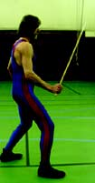
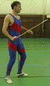
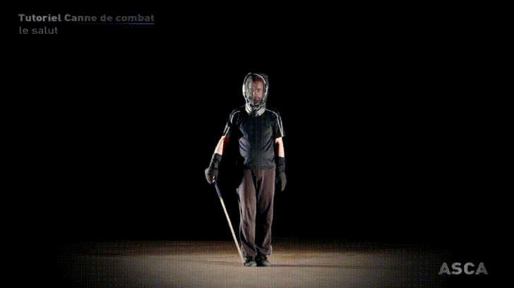
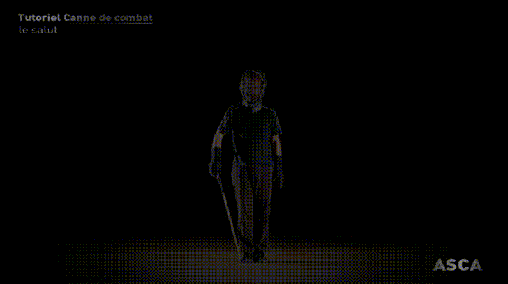

###############################################################
Méthodologie des techniques de la Canne de Combat et du Bâton
###############################################################

.. rubric:: Définition de la canne de combat

La Canne de Combat et le Bâton sont des sports de combat
utilisant une arme en bois conique et contondante. La
canne d’une longueur de 95 cm et d’un poids d’environ
120g se tient à une main. Le bâton, long de 140cm, pesant
environ 400g, se tient à deux mains.

Ces deux disciplines utilisent des mouvements de frappe
réalisés avec le côté de l’arme et non avec la pointe. Ce
sont des coups qui tranchent, apparentés aux coups de
taille du sabre sans les coups de pointe, dits d’estoc. Les
règles techniques des coups et les surfaces autorisées respectent
la méthodologie des techniques et le règlement
d’arbitrage de la Canne de Combat et du Bâton. L’esprit qui
anime ces disciplines dépend de la bonne application de
ces principes.

La pratique encore marginale de la double canne (activité
utilisant une canne dans chaque main avec les techniques
de la Canne de Combat) et du Panache (activité utilisant
à la fois les techniques de la Savate et de la Canne de
Combat), n’étant pas codifiée, respecte les règlements
techniques des différentes disciplines.

.. rubric:: Méthodologie de la canne de combat et du bâton

Ces disciplines s’inspirant des méthodes du 19 :sup:`ème`  siècle et
notamment de celle de `Maître CHARLEMONT
<https://fr.wikipedia.org/wiki/Charles_Charlemont>`_, ont été de
nouveau codifiées par Maurice SARRY dans les années
1970 dans le but de faire revivre ces disciplines et, pour ce
qui concerne la Canne de Combat, de l’adapter à la compétition.

En 2004, Bertrand DUBREUIL, Président du Comité National
de Canne de Combat et Bâton, réactualise les techniques
de la Canne de Combat et du Bâton en rédigeant
cette méthodologie.

Les éléments techniques fondamentaux et particuliers de
la Canne de Combat et du Bâton, hormis les coups eux-mêmes,
sont : la garde, la fente et l’armé. Leurs paramètres
techniques, empreints de l’histoire de ces disciplines et
de leurs valeurs d’efficacité, esthétiques et éducatives, sont
déterminants. Ils sont traités avec exhaustivité dans cette
méthodologie.

.. rubric:: Principe de base de l'activité canne de combat et bâton

Les caractéristiques techniques et réglementaires de la
pratique de la Canne de Combat et du Bâton sont fondées
sur une mise en situation d’opposition réelle. Elles sont
issues du principe d’efficacité lié aux paramètres matériels
(l’arme), historiques, physiologiques et esthétiques. Cette
situation d’opposition réelle s’exprime dans deux contextes
différents :

 * **Le cadre d’une situation duelliste**. Ce type de confrontation implique :

   * de l’incertitude, donc l’évaluation du risque et des opportunités
     d’actions dont l’objectif est de toucher sans être touché.

   * une aire de combat délimitée (circulaire de 9 m de diamètre),
     donc la gestion de l’espace dans la maîtrise des placements
     et des déplacements.

   * des formes de frappes codifiées, donc la caractérisation
     de l’arme (canne ou bâton), des cibles (tête, flanc, jambe),
     des trajectoires (4 coups verticaux, 2 coups horizontaux).

   * un temps limité (assauts de 3 à 4 reprises, chacune de 2
     minutes maximum), donc la gestion des ressources mentales
     et physiques.

 * **Le cadre d’une situation duettiste**. Ce type de confrontation implique :

   * de la coopération entre les tireurs, donc la simulation
     du risque et des opportunités d’actions dont l’objectif est
     démonstratif.

   * une aire de combat aux dimensions variables, donc
     l’adaptation des déplacements à l’espace.

   * des formes de frappes codifiées, donc la caractérisation
     de l’arme (canne ou bâton), des cibles (tête, flanc, jambe),
     des trajectoires (4 coups verticaux, 2 coups horizontaux).

   * des formes de frappes non codifiées, donc l’acceptation,
     uniquement pour le Bâton démonstratif, d’1 coup horizontal
     (coup coulissé ou glissé) et d’1 coup d’estoc (coup piqué)
     supplémentaires (:ref:`Méthodologie des techniques du Bâton<Methodologie_baton>`).

   * un temps variable sans limite maximum, donc la gestion
     des ressources mentales et physiques.

Méthodologie des techniques de la Canne de combat
--------------------------------------------------

La garde
~~~~~~~~~

**Définition :** la garde est une position de départ ou d’attente
qui précède une action tactique, offensive ou défensive.
Cette posture doit placer le tireur dans un équilibre et une
prédisposition à l’impulsion musculaire qui lui permettent
d’accéder, le plus rapidement possible et avec aisance, à
toutes les attaques et défenses.

.. _Param_garde_conven:

Paramètres techniques de la garde conventionnelle
++++++++++++++++++++++++++++++++++++++++++++++++++

**Définition :** la garde conventionnelle est la garde de
référence car c’est celle qui s’applique le mieux à la définition
ci-dessus. Pour les cannistes droitiers, la garde de
référence est la garde conventionnelle à droite, dite garde
à droite : la main droite munie de l’arme et le pied droit
sont à l’avant de la garde. Pour les cannistes gauchers, les
paramètres sont inversés.

La garde conventionnelle en Canne de combat est la garde
inverse du Bâton ou de la Boxe (ex : garde à droite en
Canne : main droite et pied droit devant ; garde à droite au
Bâton ou en Boxe : main gauche et pied gauche devant).

  La garde conventionnelle pour un droitier

.. _Position_garde_appui:

Positionnement de la partie basse (les appuis)
""""""""""""""""""""""""""""""""""""""""""""""

   1. Le tireur se positionne face à son adversaire (axe de combat).

   2. Les pieds sont écartés de la largeur des épaules.

   3. Les jambes sont légèrement fléchies pour préparer l’impulsion
      musculaire et déverrouiller les articulations dont
      un blocage présenterait, lors des rotations importantes
      inhérentes à l’exécution des coups, des contre-indications
      physiologiques. En outre, ce léger affaissement du centre
      de gravité raccourcit la descente qui mène à la fente et
      accélère ainsi son positionnement.

   4. Un des deux appuis est reculé d’une longueur de pied
      suivant la garde choisie (garde à droite en Canne : pied
      gauche derrière ; garde à gauche : pied droit derrière).

   5. Le pied avant et la main avant munie de l’arme sont
      du même côté (garde à droite : main droite tenant l’arme
      devant avec pied droit devant, et inversement dans la garde
      inversée).

   6. Le pied avant est dirigé vers l’adversaire, voire légèrement
      ouvert sur l’extérieur de la garde (garde à droite :
      pied droit devant légèrement ouvert sur la droite; garde
      à gauche : pied gauche devant légèrement ouvert sur la
      gauche). Ceci pour éviter la fermeture du pied avant qui fixe
      le tireur à l’intérieur de sa garde.

   7. Le pied arrière est ouvert de 45° environ par rapport à
      l’axe de combat.

La garde en Canne et Bâton, sous l’effet du faible recul
du pied arrière, demeure relativement frontale. Cela évite
l’alignement des appuis qui, comme la fermeture du pied
avant, est une position de protection instinctive. Elle a le
désavantage de fixer le bassin à l’intérieur de la garde, rendant
difficile l’armé des mouvements extérieurs. Ces armés
extérieurs forcés provoquent alors des torsions lombaires.
En outre, la position frontale favorise la latéralisation des
déplacements (décalages et débordements) et l’enchaîne-
ment d’actions sur les deux côtés de la garde.

   8. Le poids du corps est réparti de façon égale sur les deux
      pieds pour éviter la fixation, voire l’ancrage du tireur sur un
      seul appui.

   9. Le poids sur chaque appui est davantage porté sur l’avant
      du pied tout en conservant le talon au sol afin de favoriser
      la détente des appuis. C’est à chaque tireur de trouver le
      contact idéal de ses appuis qui favorisera l’amorce de ses
      mouvements et l’aisance de ses déplacements.

.. _Position_garde_median:

Positionnement de la partie médiane (ensemble locomoteur : cuisses, hanches, épaules)
""""""""""""""""""""""""""""""""""""""""""""""""""""""""""""""""""""""""""""""""""""""

   1. Les cuisses sont légèrement écartées pour amplifier la
      puissance d’appel des mouvements et pour déclencher sans
      contrainte, par l’ouverture du bassin, la synergie rotative des armés.

   2. Les hanches et les épaules sont alignées suivant les
      mêmes axes :

      * Axe horizontal :

         - Les axes des hanches et des épaules restent parallèles
           pour éviter les torsions lombaires lors des mouvements.

         - Les deux épaules sont à la même hauteur.

      * Axe vertical :

         - Les épaules et le buste restent droits, sans inclinaison
           vers l’avant ou l’arrière.

Il s’agit d’une position naturelle sans crispation ni autres contraintes

.. _Position_garde_haute:

Positionnement de la partie haute (ensemble transmetteur : tête, regard, bras, mains) et de l’arme (canne de combat)
"""""""""""""""""""""""""""""""""""""""""""""""""""""""""""""""""""""""""""""""""""""""""""""""""""""""""""""""""""""

   1. La tête reste droite et dirigée vers l’adversaire, sans
      crispation ni autres contraintes.

   2. Le tireur fixe le regard ou la région observée de
      son adversaire (la région observée est l’ensemble tête/
      épaules).

      * Le tireur fixe le regard de son adversaire : l’observation
        est localisée et favorise la réaction aux signes annonciateurs
        de l’action adverse.

      * Le tireur fixe la région observée de son adversaire :
        l’observation est globale et favorise la réaction au départ de
        l’action adverse.

      Dans les deux cas, l’anticipation est très bonne avec, pour
      le premier cas, l’avantage d’une éventuelle influence d’un
      tireur sur l’autre.

   3. La Canne est tenue par sa base (partie la plus large dont
      la portion restant en deçà de la main est la manchette et
      l’extrémité la plus large est le talon). La manchette ne doit
      pas excéder la largeur d’une main (règlement d’arbitrage),
      car l’utilisation de la longueur maximum de l’arme offre une
      inertie et une distance de combat qui favorisent l’amplitude
      des coups.

   4. La canne est tenue avec la main en pronation (paume
      vers le bas).

   5. La force de saisie est contrôlée. L’arme est tenue sans
      crispation comme l’on tiendrait un oiseau pour ne pas qu’il
      s’échappe mais sans l’étouffer.

   6. La main munie de l’arme est ramenée vers le buste et
      le centre de la garde, dans une flexion du bras formant
      un angle biceps/avant-bras de 90° à 110°. Cette position
      centrale permet d’accéder à tous les armés et toutes les
      parades dans les mêmes délais. D’autre part, le règlement
      d’arbitrage sanctionne une garde dont le bras avant est
      trop tendu vers l’adversaire, représentant un danger d’estoc
      involontaire.

**Rappel :** les coups d’estoc sont interdits en Canne de
Combat mais peuvent être acceptés en démonstration ou
en compétition technique en Bâton et en Canne.

   7. La canne est obliquée vers l’intérieur de la garde et la
      pointe est placée à la hauteur de la tempe de l’adversaire,
      loin devant son visage pour ne pas que cela représente un
      danger ou une gêne pour l’adversaire.

   8. Le bras arrière (non muni de l’arme) est maintenu naturellement
      fléchi, orienté vers le sol, suivant l’axe des épaules,
      et en retrait afin qu’il ne masque pas la surface de
      frappe haute (tête) et médiane (flanc : surface de frappe
      autorisée uniquement pour les catégories masculines :
      point du règlement d’arbitrage). L’époque, où l’on demandait
      au tireur d’escamoter complètement le bras derrière
      le dos, est révolue. En effet, cette contrainte mobilisait les
      muscles scapulaires, dorsaux et brachiaux dans un effort
      isométrique et asymétrique pouvant être à l’origine
      de pathologies particulières. D’autre part, la mobilité
      du bras non muni de l’arme doit contribuer à l’équilibre et à
      la mobilité des mouvements.

.. _Param_garde_conv_inv:

Paramètres techniques de la garde conventionnelle inversée
+++++++++++++++++++++++++++++++++++++++++++++++++++++++++++

**Définition :** changement de côté de la
garde conventionnelle (et non comme en Boxe où l’on définit
la garde inversée par rapport à la garde de l’adversaire).
Les cannistes droitiers passent de la garde à droite à la
garde à gauche. La main gauche munie de l’arme et le pied
gauche sont alors à l’avant de la garde. De la même façon,
les cannistes gauchers inversent leur garde.
Les paramètres techniques de la garde conventionnelle
inversée sont identiques à ceux de la :ref:`garde
conventionnelle<Param_garde_conven>`.

Paramètres techniques de la garde opposée
++++++++++++++++++++++++++++++++++++++++++

**Définition :** c’est une garde dans laquelle la main munie de
l’arme et le pied du même côté sont à l’arrière (ex : garde
à droite opposée : la main droite munie de l’arme et le pied
droit sont à l’arrière). Autrement dit, la garde opposée est
une :ref:`garde conventionnelle inversée <Param_garde_conv_inv>` dans laquelle
la canne passe de la main avant à la main arrière
Hormis la position arrière de la main munie de l’arme,
les paramètres de la garde opposée sont identiques aux paramètres fondamentaux
de la :ref:`garde conventionnelle inversée <Param_garde_conv_inv>`
donc de la :ref:`garde conventionnelle<Param_garde_conven>`.

**Remarques :** la garde opposée est naturellement utilisée
lorsqu’elle est le résultat d’une esquive de la jambe avant qui recule
et se positionne à l’arrière de la garde sans que la canne change
de main. Son utilisation est avant tout liée à des opportunités tactiques.
En outre, la garde opposée n’est pas la garde de référence car elle
rend difficile l’exécution des coups croisés (Latéral croisé, Croisé-tête,
Croisé-bas) et n’est donc pas le point de départ le plus approprié à la
mise en oeuvre de l’ensemble des techniques

  La garde opposée pour un droitier

.. _Paramètres_techniques_de_la_garde_opposée_Important:

**Important :** le règlement n’interdit pas l’utilisation de la
garde opposée ou de la fente en garde opposée. Les coups
qui sont issus de ces gardes opposées doivent respecter
les critères de validité de la touche, notamment celui de
respecter, au moment de la frappe, un angle ouvert entre la
ligne des épaules et le bras muni de l’arme.
Cependant, les gardes conventionnelles (simples ou inversées)
restent à la base de la pédagogie de la Canne de
Combat et du Bâton parce qu’elles sont les mieux adaptées
à la physiologie, à l’amplitude et à la fluidité des enchaînements
des techniques.

.. _Caractéristiques_techniques_des_changements_de_garde:

Caractéristiques techniques des changements de garde
+++++++++++++++++++++++++++++++++++++++++++++++++++++

Le changement de garde permet de varier les combinaisons tactiques
et de profiter des feintes et des ouvertures qu’offrent les changements
de main de l’arme, multipliant les opportunités offensives ou défensives.
Les changements de garde et de main peuvent s’exécuter
au cours de différentes phases, de façon simple, acrobatique et/ou
avec jongleries :

   - En attaque (au cours de voltes, d’une position d’armé à
     une autre position d’armé, passes acrobatiques),

   - En défense (lors d’esquives ou de parades),

   - Sans sollicitations offensives ou défensives (lors de sim-
     ples déplacements).

Les changements de main doivent être effectués avant la
phase de retour de l’arme vers la cible afin qu’un coup
issu d’un changement de garde et/ou d’un changement de
main, soit armé. Par conséquent, la dernière limite pour
effectuer un changement de main intégré à un coup est
la position d’armé. En revanche, il n’y a pas de dernière
limite pour effectuer un changement de garde qui n’est pas
accompagné d’un changement de main.:ref
Il est nécessaire d’inverser systématiquement les techni-
ques à l’entraînement afin que les tireurs deviennent ambi-
dextres et puissent indistinctement utiliser les différentes
gardes (en pratique, bien que leur garde de prédilection
reste toujours leur garde de référence initiale).

.. _Arme_canne:

L'armé
~~~~~~~

**Définition :** l’armé est un mouvement préparatoire à l’exécution
d’un coup, qui consiste à faire passer la main munie
de l’arme derrière l’axe vertébral pour ensuite la ramener vers la cible.

L’histoire de l’armé : une contrainte technique, une vertu tactique
++++++++++++++++++++++++++++++++++++++++++++++++++++++++++++++++++++

L’armé des coups en Canne de Combat et Bâton passe
derrière l’axe vertébral à l’inverse de la Savate où l’armé
des coups de pied est exécuté devant l’axe vertébral. Cet
armé profond des coups en Canne de Combat et Bâton
est donc une particularité qui va déterminer la technique et
l’esprit de ces disciplines.

Pour mieux le comprendre, il faut connaître sa justification
historique : en effet, la canne et le bâton ont été, tour à tour
dans l’histoire, outils, symboles, objets d’apparat, et armes
rudimentaires avant d’intégrer les écoles militaires au 19 :sup:`ème`
siècle. Moins coûteuses et moins dangereuses, ces armes
de substitution rendaient plus accessible l’apprentissage
de l’escrime.

Au début de leur histoire, ces armes en bois, s’inspirant de
l’art de la guerre français, se sont approprié les techniques
de l’épée et du sabre, notamment en contenant le développement
des coups à l’avant de la garde. Puis, après avoir
longtemps simulé la taille et l’estoc de l’escrime, la Canne
et le Bâton abandonnèrent la fausse menace de leur tran-
chant virtuel. Ces armes en bois allaient s’autodéterminer
comme discipline à part entière au travers de techniques
dont l’efficacité viendrait de leur nature même, de leur condition
d’armes contondantes et non tranchantes.

Cette mutation fut marquée par la nécessité de rajouter de
la puissance aux coups. Et c’est à la fin du 19 :sup:`ème` siècle
qu’apparurent les premiers mouvements renforcés. De la
même façon que l’on bande un arc avant de décocher, le
principe était de suffisamment reculer le bras vers l’arrière
du buste pour donner à l’arme de l’élan, du ressort, donc de
la puissance à l’impact : l’armé était né ! Il donna une réelle
identité à cette discipline en montrant des gestes nouveaux
plus amples, redoutables et esthétiques. Sur la base de
ces qualités, l’idéo-motricité de la discipline Canne et Bâton
prend tout son sens car elle perpétue les choix techniques
anciens, non pas seulement pour leur valeur historique,
mais surtout pour leur efficacité intrinsèque qui, encore
aujourd’hui dans le monde, n’a pas d’équivalent dans les
autres sports de combat de ce type.

Différents armés se sont succédés depuis l’époque de
Charlemont. On a vu les premiers armés, très hauts au
dessus de la tête, former une parade en toit de laquelle
partaient des coups obliques plongeant avec une rare puis-
sance. On a vu ensuite des armés enroulés autour de la
nuque utilisant cet axe comme un pivot propulseur. Puis,
sont apparus, à l’occasion de la renaissance de la Canne
de Combat et du Bâton dans les années 1970, les armés
actuels qui se positionnent au dessus de l’épaule afin
d’augmenter le contrôle de la précision et de la puissance
des coups.

Dans le même temps, l’apparition du masque d’escrime
dans les confrontations de Canne de Combat contribua
aussi à l’abandon de cet armé autour de la nuque, gêné par
l’encombrement de cette nouvelle protection.
Aujourd’hui, l’armé est la démonstration de cette recherche
historique de puissance sans l’impact d’origine. En effet,
celui-ci est réduit à sa plus simple expression par le règle-
ment d’arbitrage qui stipule qu’une touche doit être nette
mais non violente (le simple contact de la canne sur la cible
suffit, sans rupture de rythme).

Bien que l’armé, en tant que vestige des temps anciens, ait
des vertus justifiant sa présence dans la pratique moderne
de la Canne de Combat et du Bâton, il ne faut pas perdre
de vue qu’un coup armé a l’inconvénient d’éloigner l’arme
du centre de la garde, rendant vulnérable celui qui l’exécute,
ainsi que de signaler une attaque imminente.
Tous les coups devenant prévisibles, il devient alors difficile
de pouvoir surprendre son adversaire sur une seule
frappe. Par conséquent, la diversité des enchaînements
et de leurs applications tactiques, est une des meilleures
réponses aux contraintes de l’armé. En outre, les parades
utilisent les trajectoires des armés et rendent les ripostes
plus rapides, car lorsque qu’un tireur se positionne en
parade, il se rapproche d’une position d’armé, donc d’une
contre-attaque.

Pour toutes ces raisons, on constate que l’armé qui pouvait
apparaître comme un désavantage depuis que l’on a
réglementé la puissance des frappes qui était sa raison
d’être, est finalement une aubaine ouvrant un champ tactique
immense.

.. _Paramètres_techniques_de_l_armé_communs_à_tous_les_coups:

Paramètres techniques de l’armé communs à tous les coups
+++++++++++++++++++++++++++++++++++++++++++++++++++++++++

   1. La position de garde est la position de départ.

   2. Le buste pivote du côté de l’armé choisi, en alignant les
      hanches et les épaules dans l’axe de combat (de profil) et
      en amenant la main munie de l’arme vers l’arrière de la
      garde (derrière l’axe vertébral).

   3. **Important :** les hanches amorcent toutes les rotations
      du buste. Au cours de l’armé, la rotation des hanches tire
      vers l’arrière le bras muni de l’arme, puis le ramène vers
      la cible. On retrouve cet infime décalage entre le mouve-
      ment du bassin et le déplacement des épaules de façon
      évidente dans toutes les cinétiques des lancers comme
      dans le simple jet de pierre, le lancer du javelot, le golf, le
      Handball, etc. Ainsi, les muscles du bassin (psoas-iliaques,
      ceinture abdominale, muscles obliques jusqu’aux dorsaux),
      par un effet retard, jouent un rôle d’accélérateur en utilisant
      les relais musculaires.

Par conséquent, le transfert des masses en mouvement
est d’abord hélicoïdal, des appuis jusqu’aux épaules, avant
d’être transversal dans la projection du bras vers la cible.

   4. Les pieds pivotent à la demande pour faciliter l’amplitude
      du mouvement de rotation des hanches et des épaules.
      Les talons restent en contact avec le sol lors des mouvements
      d’armé afin que les appuis disposent de leur détente
      maximum. Cependant, pour les armés du Latéral croisé et
      du Croisé tête, un léger décollement du talon est difficile à
      éviter.

   5. Les appuis ne sont pas alignés l’un derrière l’autre, ils
      restent sur des axes parallèles pour favoriser l’équilibre et
      l’ouverture du bassin pour les coups extérieurs (`Position des appuis<Position_garde_appui>`).

   6. Le poids du corps est réparti de façon égale sur les
      :ref:`appuis<Position_garde_appui>` dans toutes les phases motrices que
      sont les mouvements (armés, développements des coups,
      parades) et les déplacements, d’un appui pour le décalage
      et des deux appuis pour le débordement, (esquives, voltes,
      fentes). Le principe du transfert de poids du corps de l’appui
      arrière vers l’appui avant qui a longtemps prévalu dans l’apprentissage
      de la Canne de Combat et du Bâton, ne favorise pas la synergie
      musculaire lors des enchaînements des coups et rend les déplacements
      offensifs et défensifs aléatoires en raison de l’ancrage par
      surcharge d’un des deux appuis (voir les points 2 et 3).

   7. L’axe de rotation du buste est l’axe vertébral.

   8. Les jambes restent légèrement :ref:`fléchies<Position_garde_appui>`.

   9. Les pieds conservent leur contact d’:ref:`appui<Position_garde_appui>`.

   10. Les épaules et les hanches sont alignées suivant les différents axes
       (:ref:`Position de la partie médiane <Position_garde_appui>`).

   11. La tête et le regard restent dans leur position initiale (axe
       de combat) (:ref:`Position de la partie haute <Position_garde_haute>`).

   12. Le bras non muni de l’arme accompagne le mouvement
       des épaules (:ref:`Position de la partie haute, Point n°8 <Position_garde_haute>`).

.. _Paramètres_techniques_de_l_armé_particuliers_aux_coups_horizontaux_intérieurs_et_extérieurs:

Paramètres techniques de l’armé particuliers aux coups horizontaux intérieurs et extérieurs : le Latéral croisé et le Latéral extérieur
++++++++++++++++++++++++++++++++++++++++++++++++++++++++++++++++++++++++++++++++++++++++++++++++++++++++++++++++++++++++++++++++++++++++

  1. Dans le temps des mouvements amorcés (:ref:`ci-dessus<Paramètres_techniques_de_l_armé_communs_à_tous_les_coups>`), la main munie de l’arme s’engage du côté de l’armé choisi, à la hauteur de la tempe, puis le bras armé est positionné derrière l’axe vertébral (angle d’environ 90° formé par le bras et l’avant-bras, bras à l’horizontale). Cet angle de 90° est optimal pour obtenir la meilleure vitesse de transmission du mouvement. En effet, un bras trop tendu augmente le levier et sature l’effort au développement de la frappe ; un bras trop fermé réduit le levier et raccourcit la course d’élan de l’ensemble propulsé (bras, canne).
  2.  Ce mouvement d’armé s’achève lorsque la canne est positionnée, proche de l’axe vertébral, la pointe dirigée vers l’adversaire (buste de profil) afin de préparer la canne à une circumduction complète qui correspond à sa course d’élan optimale. Dans cette position d’armé, le tireur place la partie supérieure de sa canne (vers la pointe) contre le haut de sa tempe. Une position trop basse (au niveau du cou) gênerait le passage de l’arme dans sa circumduction. Une position trop haute (au dessus de la tête) transformerait le coup en un mouvement circulaire ininterrompu empêchant la fixation de l’armé et le bénéfice du mouvement de piston plus direct et plus rapide.

**Observations :** on considère donc que l’armé du Latéral croisé et du Latéral extérieur est fixe. Ce qui autorise le tireur à marquer un arrêt en position d’armé.

  3. Pour l’armé du Latéral croisé, la main armée est en position latérale (paume dirigée vers l’intérieur de la garde, vers l’axe vertébral).
  4. Pour l’armé du Latéral extérieur, la main armée est positionnée en pronation, voire légèrement latéralisée (paume dirigée vers l’extérieur de la garde, à l’opposé de l’axe vertébral).
  5. Desserrer légèrement l’étreinte de la main du côté auriculaire, seulement dans la position de l’armé du Latéral croisé, afin que l’arme conserve son assiette.

.. _Paramètres_techniques_de_l_armé_particuliers_aux_coups_verticaux_extérieurs_moulinés:

Paramètres techniques de l’armé particuliers aux coups verticaux extérieurs moulinés : le Brisé et l’ Enlevé
+++++++++++++++++++++++++++++++++++++++++++++++++++++++++++++++++++++++++++++++++++++++++++++++++++++++++++++

  1. Dans le temps des mouvements amorcés (:ref:`ci-dessus<Paramètres_techniques_de_l_armé_communs_à_tous_les_coups>`), la main munie de l’arme est amenée à l’épaule (contre le deltoïde antérieur). Dans son mouvement de piston, la main armée semble observer une phase de fixation lorsqu’elle est en position de recul maximum. Cependant, le pivotement de la main et la circumduction de la canne (moulinet : rotation verticale et complète de l’arme autour du poignet) sont ininterrompus.

**Observations :** on considère donc que l’armé du Brisé et de l’Enlevé est semi-fixe. Ce qui n’autorise pas le tireur à marquer un arrêt en position d’armé.

Cette position d’armé semi-fixe correspond au moment où la main armée finit son recul derrière l’axe vertébral avant d’entamer son retour vers la cible. A ce moment là, l’orientation de la canne n’est pas imposée, elle est positionnée selon la progression du moulinet. Les hanches et les épaules s’alignent dans l’axe de combat (de profil) afin de tirer la main armée derrière l’axe vertébral.

  2. L’autre méthode qui consiste à armer le Brisé et l’Enlevé à la hauteur de la hanche, est tolérée. Toutefois, l’armé à l’épaule de ces deux mouvements est celui qu’il convient d’adopter pour les raisons suivantes :

      * Concernant le Brisé, les phases d’armé et de retour vers la cible décrivent le va-et-vient du mouvement de piston. Le Brisé a donc un effet coup de poing direct qu’il est plus efficace de faire partir de l’épaule. La distance qui va de l’armé épaule à la cible (dessus de la tête) est la plus courte. En outre, le Brisé armé à la hanche, arrive souvent sabré (angle formé entre la canne et le bras, au moment de la frappe, lorsque la main a de l’avance sur la pointe de la canne, ce que sanctionne le règlement d’arbitrage).
      * Concernant l’Enlevé, les phases d’armé et de retour vers la cible décrivent le va-et-vient elliptique du mouvement de bielle-piston. Pour l’Enlevé, l’armé à la hanche offre une trajectoire de frappe plus directe (la cible étant en ligne basse). Cependant, il rapproche le mouvement du sol lors du retour de l’arme vers la cible, obligeant le tireur à se fendre après l’impact, ce que sanctionne le règlement d’arbitrage qui stipule que les coups en ligne basse doivent être accompagnés d’une fente, la fente devant être achevée au moment de l’impact en jambe et non après. En outre, tactiquement, l’armé épaule identique pour le Brisé et l’Enlevé permet une feinte en offrant la possibilité d’ intervertir ces deux coups au moment de leur retour vers la cible, ou de transformer l’armé épaule du Brisé ou de l’Enlevé en armé de Latéral extérieur.

.. _Paramètres_techniques_de_l_armé_particuliers_aux_coups_verticaux_croisés_intérieurs:

Paramètres techniques de l’armé particuliers aux coups verticaux croisés intérieurs : le Croisé-tête et le Croisé-bas
+++++++++++++++++++++++++++++++++++++++++++++++++++++++++++++++++++++++++++++++++++++++++++++++++++++++++++++++++++++++

  1. Dans le temps des mouvements amorcés :ref:`ci-dessus<Paramètres_techniques_de_l_armé_communs_à_tous_les_coups>`, pour le Croisé-tête : la main munie de l’arme descend du côté croisé (intérieur en Canne de Combat : côté gauche pour un droitier) au niveau de la hanche opposée dans un mouvement elliptique vertical remontant ; pour le Croisé-bas : la main munie de l’arme monte du côté croisé (intérieur en Canne de Combat : côté gauche pour un droitier) au niveau du dessus de la tête dans un mouvement elliptique vertical descendant. Ces phases d’armé s’inscrivent, sans discontinuité, dans une ellipse verticale qui s’achève, pour le Croisé-tête, par une frappe en ligne haute (dessus de la tête), et pour le Croisé-bas, par une frappe latéralisée en ligne basse, (jambe) accompagnée d’une :ref:`fente<La_fente>`.

**Observations :** on considère donc que l’armé du Croisé-tête et du Croisé-bas est non- fixe. Ce qui n’autorise pas le tireur à marquer un arrêt en position d’armé, sauf dans le cas de l’armé fixe du Croisé-tête (:ref:`Ibid, Point n°3<Paramètres_techniques_de_l_armé_particuliers_aux_coups_verticaux_croisés_intérieurs>`).
Cette position d’armé non-fixe correspond au moment où l’arme est sur la tangente postérieure de l’ellipse, lorsque la main armée finit son recul derrière l’axe vertébral avant d’entamer son retour vers la cible.

  2. La canne se positionne de façon naturelle dans la circumduction verticale, proche de l’axe verébral. La main munie de l’arme se dirige, dans un premier temps, vers le bas pour le Croisé-tête et vers le haut pour le Croisé-bas. Au départ du coup, sous l’effet de la prise de vitesse de la main, la pointe de la canne a un temps de retard. Ce retard, libérant la main d’une partie du poids de l’arme, favorise l’accélération du mouvement. Ce retard doit être rattrapé au moment de l’impact.
  3. Le Croisé-tête part souvent d’une position de parade basse comme d’un armé fixe. Pour obtenir cette position particulière de l’armé fixe du Croisé-tête, la canne (pointe en bas) est positionnée en parade croisée, légèrement obliquée vers l’avant, main tournée, paume vers l’adversaire. Le bras armé est collé au corps afin de profiter au mieux de la synergie des hanches.

**Conclusion :** l’armé est donc une position transitoire, de passage (préparation du coup) dont les applications techniques et tactiques résultent de sa parfaite mise en œuvre et conditionnent la bonne exécution de la phase finale du coup.

.. _La_fente:

La fente
~~~~~~~~~

**Définition :** la fente est une disposition réglementaire qui oblige le tireur qui frappe en ligne basse (jambe) à accompagner son coup de la flexion d’une jambe (dessus de la cuisse au minimum parallèle au sol, voire plus bas) et de l’extension de l’autre jambe.*

L’histoire récente de la fente : une question de sécurité
+++++++++++++++++++++++++++++++++++++++++++++++++++++++++++

Longtemps, la fente de la Canne et du Bâton (jusqu’au début du 20 :sup:`ème` siècle) s’est inspirée de la fente de l’escrime. C’était une fente assez haute, surtout utilisée à l’estoc pour des coups en lignes haute ou médiane. Elle favorisait la propulsion et l’allongement du bras d’attaque et offrait, dans un abaissement du tireur, une réduction des surfaces de frappe exposées. Son utilisation n’avait pas, comme dans les disciplines de Canne de Combat et Bâton actuelles, de caractère obligatoire.

Depuis la réactualisation de la Canne et du Bâton dans les années 1970, l’unique raison de cette :ref:`contrainte réglementée<La_fente>` est de réduire l’oblicuité des coups jugée trop dangereuse, sachant que les coups d’estoc ont déjà été supprimés pour le même motif. L’estoc (coups piqués) peut être autorisé seulement en démonstration et en compétition technique en Canne et en Bâton.

Il n’est pas autorisé de frapper en ligne haute ou médiane avec une fente et de frapper en ligne basse sans fente. La frappe en ligne basse, accompagnée d’une flexion des deux jambes, est autorisée dans :ref:`un seul cas<Paramètres_techniques_de_la_Flexion>`. La contrainte de la fente, comme celle de l’armé, ont su trouver une réponse tactique. Par exemple : la fente peut être utilisée comme une esquive offensive sur un coup reçu en ligne haute ou médiane.

**Conclusion :** les critères réglementaires de la :ref:`fente<La_fente>` réclament une grande mobilisation musculaire qui fait de la fente un mouvement de grande tension dont la mauvaise exécution présente des contre-indications physiologiques. L’application des paramètres énoncés ci-après, évitera l’altération de l’intégrité physique des tireurs et favorisera, dans le respect des règles, l’efficacité des coups dans leur amplitude, rapidité et mise à distance des frappes. Par conséquent, l’échauffement spécifique, préparatoire à l’exécution des fentes (hanches en abduction) doit être très progressif et centré sur les étirements plus que sur la musculation. Il doit tenir compte de la physiologie du pratiquant. Cet échauffement, dans la mesure du possible, doit être personnalisé suivant l’entraînement qui lui succède, et individualisé suivant l’échantillonnage du public auquel il est adressé. Les muscles les plus sollicités dans l’exercice de la fente sont : les mollets (avec le tendon d’Achille), les adducteurs, les ischio-jambiers jumeaux, les tenseurs du fascia lata, le courturier, le pectiné, le pyramidal, l’obturateur interne, les quadriceps et les fessiers. Dans la progression de l’apprentissage des fentes, il est conseillé de n’aborder la fente arrière (position d’écart facial de grande tension) qu’après l’apprentissage complet de la fente avant (position d’écart entéro-postérieur) de moindre tension.

.. _fente_comuns:

Paramètres techniques communs à toutes les fentes
++++++++++++++++++++++++++++++++++++++++++++++++++

La position de fente en garde opposée n’est pas interdite à condition que la ligne des épaules et le bras muni de l’ame observent un angle ouvert (+ de 90°) au moment de la frappe (:ref:`Garde opposée <Paramètres_techniques_de_la_garde_opposée_Important>`).
Toutes les fentes existantes sont classées suivant les deux catégories de fentes suivantes : les Fentes avant (position d’écart antéro-postérieur: jambes écartées vers l’avant et l’arrière du bassin) et les Fentes arrière (position d’écart facial : jambes écartées sur les côtes du bassin) qui peuvent s’orienter de façon différente, devenant des Fentes latérales ou opposées.

La position de fente n’est pas toujours statique, elle peut changer au cours de l’exécution d’un coup ou d’un enchaînement de coups, exemple : passage de la Fente avant à la Fente arrière lorsque la cible n’est plus la jambe arrière, mais devient la jambe avant ; exemple : déplacements en position de fente pour atteindre une cible :ref:`mouvante<Les_déplacements>`.

  1. Les fentes sont exécutées à partir de cinq déplacements fondamentaux partant de la garde :

    * Longitudinal (parallèle à l’axe de combat : par progression ou recul de l’un des deux appuis, l’autre appui ne bougeant pas, ou par déplacements profonds des deux appuis dans un bond, un pas simple (changement de garde) ou un pas chassé.
    * Latéral (perpendiculaire à l’axe de combat) : par déplacement latéral de l’un des deux appuis, l’autre appui ne bougeant pas, ou par déplacements profonds des deux appuis dans un bond ou un pas chassé.
    * Transversal (oblique) : déplacement situé entre les parallèle et la perpendiculaire de l’axe de combat. Utiliser les paramètres du déplacement longitudinal ou latéral suivant que cette obliquité se rapproche plus de l’un que de l’autre.
    * Sur place : les deux appuis s’écartent en même temps. Longitudinalement, l’appui avant vers l’avant et l’appui arrière vers l’arrière, latéralement ou tranversalement, un appui vers la gauche et l’autre vers la droite (l’axe vertébral reste sur place) ou par déplacements profonds des deux appuis dans un bond, un pas simple (changement de garde) ou un pas chassé

**Rappel :** les fentes sont exécutées avec une jambe fléchie (dessus de la cuisse au minimum parallèle au sol, voire plus bas) et l’autre jambe en extension (règlement d’arbitrage).

  2. Le buste est légèrement incliné vers l’avant. Sur le plan technico-tactique, une position trop inclinée rajoute du poids sur l’appui avant et ancre le tireur sur cet appui, ce qui nuit à une bonne continuité dans l’enchaînement des techniques. Sur le plan physiologiquement, cette position exerce une tension lombaire importante en raison du grand bras de levier que représente le dos penché vers l’avant.
  3. L’angle formé par la ligne des épaules et le bras muni de l’arme est ouvert (règlement d’arbitrage).
  4. Malgré la position basse des fentes, le regard est toujours dirigé vers celui de l’adversaire, ou sa région observée (:ref:`Position partie haute, Point n°2 <Position_garde_haute>`), quelque soit l’inclinaison du buste afin de ne pas relâcher la surveillance en direction de l’adversaire et pour éviter de présenter à l’adversaire la partie postérieure de la tête en orientant la face vers le sol (position sanctionnée par le règlement d’arbitrage car elle escamote une surface de frappe et présente un danger par l’exposition de la nuque).
  5. La fente est achevée, au plus tard, au moment de l’impact.
  6. Les appuis restent sur des axes parallèles pour favoriser l’équilibre et l’ouverture du bassin pour les coups extérieurs en Canne de Combat.
  7. **Important :** la position qui consiste à poser l’appui de la jambe en extension sur le côté intérieur du pied, est totalement contre-indiquée. Physiologiquement, cette position de pied exerce une torsion de la cheville qui abaisse la malléole et le genou, verrouillant l’articulation de la jambe. La stabilité que la jambe en extension apporte à la fente n’est plus alors assurée par la musculature mais par la butée des ligaments du genou et de la cheville, décalant l’inertie du mouvement sur le côté du genou et de la cheville et non derrière eux. Cette poussée latéralisée peut provoquer de graves lésions des ligaments latéraux et croisés du genou. D’autre part, tactiquement, cette position dans laquelle l’appui de la jambe en extension n’est pas en contact plantaire avec le sol, rend cette jambe inopérante dans la dynamique qui succède à la fente.

.. _Paramètres_techniques_de_la_Fente_avant:

Paramètres techniques de la Fente avant
+++++++++++++++++++++++++++++++++++++++++

**Définition :** la jambe avant est fléchie et la jambe arrière en extension. Dans le cas de la Fente avant de référence, (non opposée et non latérale), la main munie de l’arme est du côté de la jambe avant fléchie. Le pied de la jambe fléchie est parallèle à la jambe en extension dans un écart antéro-postérieur (jambes écartées vers l’avant et l’arrière du bassin) ce critère supplémentaire permet de reconnaître une fente avant lorsqu’elle est dans une position opposée ou latérale. Sur un plan tactique, la Fente avant de référence (non opposée et non latérale) ne présente pas de contre-indication de position à la différence de la :ref:`Fente arrière<Paramètres_techniques_de_la_Fente_arrière>`.

  1. Le poids du corps est réparti de façon presque égale sur les deux appuis avec une légère prédominance sur l’appui avant renforcée lors de l’étirement de la fente vers l’avant afin de remettre à distance de frappe un adversaire qui rompt.
  2. La jambe avant est fléchie afin que l’angle formé par le sol et le tibia soit de 90°, et l’angle formé par le tibia et le dessus de la cuisse soit également de 90° (quadriceps à l’horizontale). Une position dans laquelle le genou est devant l’aplomb de la malléole met en tension excessive le ligament rotulien et le tendon d’Achille, et en compression postérieure, le ménisque. Une position dans laquelle le genou est derrière l’aplomb de la malléole met en tension excessive les ligaments croisés, et en compression antérieure, le ménisque.
  3. Le pied avant de la jambe fléchie est dirigé vers l’adversaire (définition de la Fente avant), voire légèrement ouvert sur l’extérieur (:ref:`Position partie basse, Point n°6<Position_garde_appui>`)
  4. Le poids sur le pied avant est davantage porté sur la partie avant du pied que sur le talon. Cette surcharge sur les métatarses (partie antérieure du pied) permet d’obtenir un meilleur équilibre et des appuis plus réactifs.
  5. La jambe arrière est en extension sans verrouillage de l’articulation du genou (quelques degrés de flexion sont communément acceptés).
  6. Le pied arrière de la jambe en extension est ouvert d’environ 45° par rapport à l’axe de combat et est en contact plantaire avec le sol (meilleur équilibre et appui réactif).
  7. Le poids sur le pied arrière est davantage porté sur l’avant du pied que sur le talon (meilleur équilibre et appui réactif).
  8. **Remarque :** en Fente avant uniquement, la position qui consiste à placer le pied de la jambe en extension dans l’axe de celle-ci (pointe de pied dirigée vers la jambe fléchie) a l’avantage de permettre le déverrouillage vers le bas de la jambe en extension, mais l’inconvénient de ne pas favoriser l’extension minimum requise par le règlement et de ne pas bien stabiliser la fente. Pour améliorer cette extension, le talon peut être posé au sol, mais il met alors sous tension excessive le tendon d’Achille et le mollet. Pour ces motifs, cette position de pied orientée dans l’axe de combat est déconseillée.
  9. Le bras non muni de l’arme est en retrait (:ref:`Position partie haute, Point n°8<Position_garde_haute>`).

.. _Paramètres_techniques_de_la_Fente_arrière:

Paramètres techniques de la Fente arrière
+++++++++++++++++++++++++++++++++++++++++

**Définition :** la jambe avant est en extension et la jambe arrière fléchie. Dans le cas de la Fente arrière de référence (non opposée et non latérale) la main avant munie de l’arme est du côté de la jambe avant tendue. Le pied de la jambe fléchie est perpendiculaire à la jambe en extension dans un écart facial (jambes écartées sur les côtés du bassin), ce critère supplémentaire permet de reconnaître une fente arrière lorsqu’elle est dans une position opposée ou latérale. Sur le plan tactique, la Fente arrière de référence (non opposée et non latérale) est opportune lorsqu’elle est utilisée pour se dégager d’un corps à corps, en se positionnant en fente à distance de frappe en reculant uniquement la jambe arrière. En revanche, lorsque cette fente est exécutée en progression vers l’adversaire ou latéralement elle a le désavantage de trop exposer la jambe tendue.

  1. Le poids du corps est réparti de façon inégale sur les deux appuis. Le recul naturel de la Fente arrière distribue davantage de poids à l’arrière de la fente (sur la jambe fléchie). La surcharge de la jambe arrière favorise la vitesse d’affaissement de cette fente et place le tireur sur une assise basse, dans une position avec peu de variables.
  2. Le pied arrière de la jambe fléchie est perpendiculaire à la jambe en extension (définition de la Fente arrière).
  3. Le contact d’appui de la jambe arrière fléchie change selon que le talon touche le sol ou non, ce qui détermine certains éléments techniques. La position talon décollé du sol permet le redressement du buste et, en Canne de Combat, rend l’exécution du Latéral extérieur moins difficile que dans la position talon au sol. Au Bâton, ce sera le latéral croisé (:ref:`Garde au batôn, Important<La_garde_baton>`). En revanche, la position talon au sol a l’avantage de freiner tardivement l’affaissement de la fente et d’augmenter ainsi la vitesse de la phase terminale du coup.
  4. Le pied avant de la jambe en extension est en contact plantaire avec le sol et s’oriente naturellement de 45° vers l’intérieur de la fente.
  5. **Remarque :** en Fente arrière uniquement, la position qui consiste à placer le pied avant de la jambe en extension à la verticale, pointe du pied vers le haut et talon d’Achille au sol est déconseillée. Tactiquement, cette position, dans laquelle l’appui de la jambe en extension n’est pas en contact plantaire avec le sol, rend cette jambe inopérante dans la dynamique qui suit la fente. Physiologiquement, cette position raidit la jambe avant dans une tension excessive, bien que le déverrouillage vers le haut de l’articulation soit facilité par cette position.
  6. Le bras non muni de l’arme :

     * est positionné entre les jambes (bras rentrant), le coude vers le sol, appuyé contre l’intérieur du genou de la jambe arrière fléchie pour ramener du poids sur l’appui avant, rééquilibrant les appuis et les rendant plus opérationnels dans la motricité qui suit la fente.
     * se positionne en retrait (:ref:`bras sortant, devant ou sur le côté du buste<Position_garde_haute>`) pour mieux stabiliser la fente arrière (surtout pour les débutants).

.. _Paramètres_techniques_de_la_Flexion:

Paramètres techniques de la Flexion
+++++++++++++++++++++++++++++++++++++

**Définition :** La flexion répond à une disposition réglementaire qui autorise le tireur qui frappe en ligne basse (jambe) à accompagner son coup de la flexion des deux jambes (dessus des cuisses au minimum parallèle au sol, voire plus bas) à la place d’une fente, uniquement dans le cas ou cette flexion est, dans son premier mouvement, l’esquive d’un coup. La riposte en flexion doit s’exécuter dans le temps finale de la flexion (comme pour la fente, la flexion doit être positionnée, au plus tard, au moment de la frappe). En effet, la flexion ne peut pas être une position d’attente de laquelle seraient exécutés des coups sans être directement liés à l’esquive que représente le mouvement amorçant la flexion.

  1. La position des appuis est celle de la :ref:`garde<Position_garde_appui>`.
  2. Le poids du corps est réparti de façon égale sur les deux appuis (:ref:`Position partie basse, Point n°8<Position_garde_appui>` et :ref:`Paramètres techniques de l’armé, Point n°6<Paramètres_techniques_de_l_armé_communs_à_tous_les_coups>`)
  3. Les genoux sont écartés de la largeur des épaules pour faciliter l’équilibre et l’impulsion musculaire de la sortie de flexion.
  4. L’angle formé par la ligne des épaules et le bras muni de l’arme est ouvert (règlement d’arbitrage).
  5. Le contact des appuis change selon que les talons touchent le sol ou non, ce qui détermine certains éléments technico-tactiques. La position talons décollés du sol permet le redressement du buste et, en Canne de Combat, rend l’exécution du Latéral extérieur moins difficile que dans la position talons au sol. Au Bâton, ce sera le latéral croisé (:ref:`Garde au batôn, Important<La_garde_baton>`). En revanche, la position talons au sol a l’avantage de freiner tardivement l’affaissement de la flexion et d’augmenter ainsi la vitesse de la phase terminale du coup.
  6. Le bras non muni de l’arme est en :ref:`retrait<Position_garde_haute>`.
  7. **Conclusion :** le choix de la fente doit se faire en fonction d’options techniques et tactiques, mais avant tout, par rapport au confort physiologique que sa position procure au cours du développement des coups.

.. _Les_déplacements:

Les déplacements
~~~~~~~~~~~~~~~~~

**Introduction :** la motricité des sports de combat est l’expression d’une mobilité qui prend en compte les contraintes techniques et tactiques de la discipline et les capacités du tireur à les assumer en fonction de ses objectifs, de sa physiologie et des velléités de l’adversaire.

**Définition :** le déplacement est défini par le changement de position d’au moins un des deux appuis. Il permet au tireur d’obtenir, de conserver une distance de combat (distance de frappe) ou de s’y dérober. La notion de déplacement étant étroitement liée à la gestion de l’occupation de l’aire de combat, il a été choisi de définir les déplacements par rapport à ceux des appuis et non du centre de gravité qui qualifieraient de déplacements une flexion ou un saut sauf s’ils sont accompagnés d’un déplacement horizontal. Les déplacements offensifs ont pour objet de régler une distance de frappe et/ou de positionner l’adversaire dans des configurations défensives fragilisées (feintes de corps et recherche de nouveaux angles de frappe). L’amplitude des déplacements varie selon l’engagement d’un ou des deux appuis. La mobilisation des appuis est alors qualifiée de deux façons différentes : le décalage (déplacement d’un appui) ; le débordement (déplacement des deux appuis). Les déplacements défensifs ont pour objet de retirer une zone de frappe et/ou d’amorcer une contre-attaque. Par conséquent, lorsqu’un déplacement initialement défensif devient offensif, il est qualifié de décalage ou débordement (termes habituellement réservés aux déplacements offensifs).

  1. Les déplacements varient selon leur amplitude, leur vitesse et leur nature offensive ou défensive.
  2. Ils sont caractérisés par la nécessité de maintenir les appuis opérationnels (réactifs) en toutes circonstances, tout en répondant aux spécificités techniques de la discipline et tactiques de la situation de combat.
  3. On dénombre neuf principaux types de déplacements :

     * **Le pas marché :** à utiliser de préférence hors des distances de combat, car les appuis se croisent et sont ainsi vulnérables.
     * **Le pas couru :** à utiliser de préférence hors des distances de combat, car les appuis se croisent et décollent du sol et sont ainsi vulnérables.
     * **Le pas chassé :** un pied chasse l’autre, en profondeur (dans l’axe de combat), latéralement (sur le côté). A utiliser de préférence hors des distances de combat, car les appuis se rapprochent ou se croisent et sont ainsi vulnérables.
     * **Le pas glissé ou progressif :** le pied qui est du côté du déplacement progresse en premier, suivi de l’autre pied (déplacement à droite : pied droit en premier ; déplacement vers l’avant : pied avant en premier ; etc.). Si l’écartement est modéré et les appuis ne se rapprochent pas trop lors du déplacement, ce pas peut être utilisé à distance de combat, car les appuis :ref:`restent opérationnels<Position_garde_appui>`.
     * **Le pas slalomé :** progression qui décrit un louvoiement en passant d’un appui à l’autre. Ce déplacement peut être assimilé à des décalages ou à des débordements successifs des deux côtés de l’axe de combat. Ce pas peut être utilisé à distance de combat, car les appuis :ref:`restent opérationnels<Position_garde_appui>`.
     * **Le pas rotatif ou en volte :** déplacement tournant offensif ou défensif. Ce pas peut être utilisé à distance de combat, car les appuis :ref:`restent opérationnels<Position_garde_appui>`.
     * **Le bond ou saut :** déplacement vertical et/ou horizontal avec décollement des appuis, surtout utilisé en esquive riposte ou en progression rapide vers une position d’attaque ou de défense. Les coups aériens compensent la perte des appuis par la fixation du bassin en position sautée à partir de laquelle la forte mobilisation des muscles de la ceinture abdominale transmet le mouvement de la frappe comme par exemple : un tir sauté au handball. Ce déplacement peut être donc utilisé à distance de combat, même si les appuis :ref:`ne sont pas opérationnels<Position_garde_appui>`.
     * **La fente ou flexion :** déplacement en position basse qui respecte les paramètres de la :ref:`fente<La_fente>` ou de la :ref:`flexion<Paramètres_techniques_de_la_Flexion>`. Ce déplacement peut être utilisé à distance de combat, car les appuis :ref:`restent opérationnels<Position_garde_appui>`.
     * **Le déplacement acrobatique :** en dehors du salto classé dans les sauts, on observe surtout des figures acrobatiques avec appui des mains au sol comme la roue, la rondade ou le flip. Ces déplacements n’ont pas seulement un effet démonstratif mais peuvent être réellement :ref:`efficaces<Position_garde_appui>` et être utilisés à distance de combat.

  4. Plusieurs types de déplacements sont parfois mêlés, comme : la volte sautée ; la marche sautée ; la fente en pas chassés, etc. La plupart de ces déplacements peuvent s’achever sur un changement de garde, ce qui augmente d’autant le nombre de positions qui en résultent.
  5. **Remarque :** sachant que la synergie de tout mouvement, en dehors des sauts, part des appuis, il est nécessaire pour obtenir une motricité réactive, de conserver les appuis en contact avec le sol ou près du sol. Ce qui signifie que les différents pas devront être plutôt glissés qu’enjambés.

.. _Les_parades_et_les_esquives:

Les parades et les esquives
~~~~~~~~~~~~~~~~~~~~~~~~~~~~

Dans le cas d’une contre-attaque, ces mouvements défensifs doivent toujours la précéder afin que soit respecté l’un des principes fondamentaux de la Canne de Combat et du Bâton : le respect de la parade ou de l’esquive/riposte. En effet, la logique du combat veut que l’on ne puisse pas riposter immédiatement lorsque l’on vient d’être touché. Dans ce cas-là, la contre-attaque ne peut être déclenchée qu’après une césure, la contre-attaque devient alors une attaque simple débutant une nouvelle action de combat.

Les parades
++++++++++++

  1. **Remarque :** sur un plan technico-tactique, de la même manière que la rotation des hanches tire le bras vers l’armé, la rotation des hanches tire le bras vers les parades latérales afin de pouvoir transformer très rapidement la parade en armé. Les parades en toit parant les coups verticaux ne sont pas directement engagées par les hanches mais le deviennent dans les parades actives, appelées également parades volantes, offensives ou parades/ripostes (:ref:`Parades et esquives, Point n°12<Les_parades_et_les_esquives>`).
  2. Il y a deux grandes catégories de parades qui correspondent aux deux côtés de la garde :

    * Les parades extérieures (du côté extérieur de la garde).

      * En Canne de Combat : elles sont du côté des armés des coups extérieurs.
      * Au Bâton : les parades du côté des armés des coups extérieurs sont paradoxalement du côté intérieur de la garde et se nomment ainsi parades intérieures (:ref:`Garde au batôn, Important<La_garde_baton>`).

    Par conséquent, les parades extérieures en Canne de Combat et les parades intérieures en Bâton, sont à droite de la garde, pour un droitier.

    * Les parades croisées (du côté intérieur de la garde).

      * En Canne de Combat : elles sont du côté des armés des coups croisés, côté intérieur de la garde.
      * Au Bâton : les parades du côté des armés des coups croisés, sont paradoxalement du côté extérieur de la garde, mais conservent leur dénomination de parades croisées (:ref:`Garde au batôn, Important<La_garde_baton>`).

    Par conséquent, en Canne de Combat et en Bâton, les parades croisés sont à gauche de la garde, pour un droitier.

  3. Pour les parades extérieures ou croisées en lignes haute ou médiane parant les coups horizontaux, les deux positions, pointe de l’arme vers le haut (main au niveau de la ceinture) ou vers le bas (main au niveau de la partie supérieure du crâne), sont possibles en fonction de l’orientation offensive ou défensive qui est donnée à la suite de la parade.
  4. Pour les parades en ligne basse parant les coups horizontaux, seule la parade, pointe en bas (main au niveau de la hanche ou de l’épaule en position de fente), est autorisée. En effet, le règlement d’arbitrage stipule que les parades en ligne basse,en position accroupie, pointe de l’arme vers le haut ou vers le bas offrant une protection des trois lignes horizontales à la fois en recroquevillant son utilisateur, ferment le combat et présentent donc un caractère anti-sportif. Par conséquent, leur utilisation pourra être suivie de sanctions.
  5. La main qui tient l’arme verticalement, dans certaines positions de parades, peut orienter sa paume suivant des directions différentes en fonction de l’orientation offensive ou défensive qui est donnée à la suite de la parade.
  6. Pour toutes les parades, le tireur rapproche légèrement la pointe de sa canne vers lui, vers son axe vertébral, l’arme est ainsi obliquée afin de :

    * Positionner la moitié supérieure de la canne (partie de l’arme qui arrête le coup) près du corps du défenseur pour protéger le mieux possible la surface de frappe sur les différents angles d’attaque.
    * Provoquer l’échappement de la canne qui exécute l’attaque. Ceci dans un glissement vers la pointe de la canne qui pare afin que la canne de l’attaquant ne revienne pas sur la main du défenseur.
    * Favoriser l’amorce de l’armé à partir de la parade en limitant le déplacement de la pointe de l’arme pendant la transition de la parade en armé. Cette fixation de la pointe de l’arme rend également plus rapide le passage d’une parade à une autre. Exemple : lorsque l’on passe d’une parade extérieure flanc (pointe en haut) à une parade croisée flanc (point en haut), hormis la base de l’arme qui se déplace avec la main et les hanches qui l’accompagnent d’un côté à l’autre de la garde, la pointe de la canne se dépace très peu latéralement, restant près de l’axe vertébral, l’arme changeant d’inclinaison de la première parade à la deuxième.

  7. Le trajet qu’emprunte la canne pour aller de la garde à la parade croisée basse peut suivre différentes trajectoires (avant, arrière ou latérale) en fonction du degré d’anticipation de l’attaque et de l’orientation offensive ou défensive qui sera donnée à la suite de la parade.

    **Exemple :** lorsque la parade croisée basse (pointe en bas) arrive par l’avant ou le côté intérieur de la garde (par le côté extérieur : risque de retard de la parade), la riposte sera naturellement un croisé-tête, un latéral croisé ou un croisé-bas suivant la position de la main munie de l’arme en parade (paume tournée vers l’extérieur de la garde : riposte en croisé-tête ; paume tournée vers l’intérieur de la garde : riposte en latéral croisé ou en croisé-bas). Lorsque la parade croisée basse (pointe en bas) arrive par l’arrière de la garde, la riposte sera naturellement un coup extérieur (brisé, enlevé, latéral extérieur) ou un croisé-bas s’il est suffisamment anticipé.

  8. Le contact de la pointe de la canne avec le sol est déconseillé, lors des parades basses, afin de ne pas interrompre, dans une pose musculaire, la synergie qui suit la parade dans son orientation offensive ou défensive.
  9. Les parades acrobatiques derrière le dos ont une efficacité relative qui dépend du mouvement qui les intègre, comme la volte défensive.
  10. Les parades dites : actives, offensives, volantes ou parades/ripostes sont des parades qui se transforment en mouvement offensif dans un geste continu. La parade n’est plus alors qu’une position transitoire avant l’armé. Ces parades peuvent aller jusqu’au balayage de la canne adverse, à la condition qu’elles ne repoussent pas ou n’emportent pas la canne adverse dans un choc violent.

Les esquives
++++++++++++

**Définition :** les esquives sont des mouvements ou des déplacements défensifs qui soustraient les surfaces de frappe aux attaques.

  1. **Remarque :** l’esquive, n’engageant pas un écran défensif, libère la canne du tireur pour lui permettre la riposte dans le temps exact de l’esquive. Les parades, souvent piégées par des feintes, peuvent, soit s’accompagner d’une esquive opposée et complémentaire (pour une protection complète : parer en ligne haute et médiane et esquiver en même temps en ligne basse ou inversement,), soit être remplacées par une esquive totale, lorsque l’anticipation le permet.
  2. Il y a trois grandes catégories d’esquives :

    * Esquives sur place (retrait de la surface visée sans déplacement des appuis) :

      * Retrait de la tête par esquives de boxeur.
      * Retrait du buste par rétroversion (cambrure lombaire : contre-indication physiologique).
      * Retrait de la tête et du flanc par flexion ou fente.

    * Esquives partielles avec déplacement d’un seul appui dont les :ref:`décalages<Les_déplacements>` et les :ref:`changements de garde<Caractéristiques_techniques_des_changements_de_garde>` :

      * Retrait du buste ou du corps entier, notamment par changement de garde en reculant le pied avant, suffisamment pour qu’il se positionne derrière le pied arrière.
      * Retrait d’une jambe en la déplaçant horizontalement ou verticalement, notamment en adoptant la position d’équilibre sur un pied ou la position de fente ou de la flexion pour l’esquive d’un coup en ligne haute.

    * Esquives totales avec déplacement des deux appuis dont les :ref:`débordements<Les_déplacements>` et les :ref:`changements de garde<Caractéristiques_techniques_des_changements_de_garde>` :

      * Retrait du corps entier par déplacement des deux appuis (déplacements latéraux : vers la droite ou la gauche ; en profondeur : vers l’arrière ou l’avant ; en biais : déplacements desaxés). La progression pénétrante qui projette le défenseur vers l’avant jusqu’à le positionner dans le dos de l’attaquant comporte une phase d’anti-jeu (règlement d’arbitrage). Cette phase d’anti-jeu est constatée lorsque le défenseur s’avance, dans un premier temps, vers l’attaquant avant de passer derrière lui. En effet, la règle stipule qu’une avancée du défenseur qui empêche l’attaquant de toucher la cible avec le quart supérieur de la canne est qualifiée d’anti-jeu, sauf lorsque ce déplacement vers l’avant est suivi, dans un même mouvement, d’une attaque à distance exécutée par le défenseur.
      * On trouve également dans les esquives totales par déplacement des deux appuis : les voltes et toutes les esquives sautées, simples ou acrobatiques (:ref:`Les déplacements, Point n°3<Les_déplacements>`).

.. _Les_coups_canne:

Description technique des coups de la Canne de Combat
~~~~~~~~~~~~~~~~~~~~~~~~~~~~~~~~~~~~~~~~~~~~~~~~~~~~~~~~

.. _Rappel_des_règles_techniques_de_la_validité_d_une_touche:

Rappel des règles techniques de la validité d’une touche
+++++++++++++++++++++++++++++++++++++++++++++++++++++++++

Les règles techniques de la validité d’une touche comprenant 10 critères de validité. Ces 10 critères sont classés en deux catégories :

  1. Six critères inhérant à l’image globale de la touche
  2. Quatre critères inhérant à la mise en situation opérationnelle de la touche

Six critères inhérant à l’image globale de la touche
+++++++++++++++++++++++++++++++++++++++++++++++++++++

  1. Obligation d’armer les coups (main munie de l’arme reculant, dans un premier temps, derrière l’axe vertébral avant de revenir vers la cible).
  2. Obligation d’accompagner les attaques en jambe d’une fente (avant, arrière ou latérale) ou d’une :ref:`flexion<Paramètres_techniques_de_la_Flexion>` avec interdiction d’accompagner les attaques en ligne haute d’une fente ou d’une flexion.
  3. Respect du plan et de l’axe de rotation des coups (exemple : les armés des Latéraux extérieurs et croisés avec canne verticale ou main trop basse sont interdits ; les trajectoires remontantes ou descendantes des Latéraux extérieurs ou croisés sont interdites ; l’Enlevé et le Brisé avec canne obliquée vers l’extérieur ou l’intérieur du plan de rotation sont interdits ; le bras fléchi lors du développement arrière du croisé bas et haut sont interdits ; etc.).
  4. Obligation d’exécuter la circumduction de l’arme derrière l’axe vertébral.
  5. Obligation d’observer un angle ouvert entre la ligne des épaules et le bras muni de l’arme au moment de la touche.
  6. Obligation de positionner la Canne dans le prolongement du bras et de l’avant bras au moment de la touche

Quatre critères inhérant à la mise en situation opérationnelle de la touche
++++++++++++++++++++++++++++++++++++++++++++++++++++++++++++++++++++++++++++

  7. Respect du principe de parade ou esquive/riposte
  8. Obligation de n’atteindre les cilbes qu’avec le quart supérieur de l’arme et avec le côté de celle-ci (l’estoc : coup de pointe interdit en combat)
  9. Respect de la qualité règlementaire de l’impact de l’arme sur la cible : la touche doit être nette et non violente (le simple contact entre la canne et la cible suffit, sans rupture de rythme)
  10. Respect des surfaces de frappe autorisées (tête, flanc, jambes) :

    * Le dessus et les faces latérales de la tête. Le grillage de la face antérieure est autorisé lorsque la canne le touche dans un axe perpendiculaire, l’attaquant se trouvant sur le côté du défenseur. En dehors de cette configuration, les frottements de la pointe de la canne sur le grillage ne sont pas valides.
    * Le flanc est autorisé uniquement pour la catégorie masculine (surface située entre la ceinture et les aisselles, sur ses faces latérales et sa face antérieure).
    * La jambe (surface située entre la cheville et le genou). Le mollet est autorisé.

Toutes les autres surfaces sont donc interdites : pied, cheville, genou, cuisses, hanches, triangle génital, fessiers, dos, mains, bras, épaules, cou, nuque, partie postérieure de la tête.

.. _Les_coups_Observations:

Observations
+++++++++++++

  * Pour tous les coups décrits ci-après, la rotation du poignet, à l’issue de la phase d’armé, doit impérativement s’effectuer derrière l’axe vertébral et, de la même façon, environ 80 % de la circumduction totale de la canne sont réalisés derrière l’axe (:ref:`sauf au Bâton<Les_coups_baton>`)

  * La position de la main munie de l’arme, au moment de l’impact, varie selon les trajectoires utilisées et selon l’amorce la plus favorable pour le coup suivant. Exemples : au moment de la frappe, la position de la main en supination favorise l’enchaînement du Croisé-bas ou du Latéral croisé (position défavorable de la main pour l’amorce rapide des autres coups) ; la position de la main en pronation favorise l’enchaînement du Latéral extérieur ou du Croisé-tête (position défavorable de la main pour l’amorce rapide des autres coups) ; la position de la main en position intermédiaire, la paume tournée vers l’intérieur de la garde, le pouce vers le haut, favorise l’enchaînement de tous les coups sauf du Croisé-tête (position défavorable de la main nécessitant un retournement complet de la main pour l’amorce du Croisé-tête) ; la position de la main en position intermédiaire, la paume tournée vers l’extérieur de la garde, le pouce vers le bas, favorise l’enchaînement du Croisé-tête, du Latéral extérieur ou de l’Enlevé (position défavorable de la main pour l’amorce rapide des autres coups), mais elle est déconseillée car elle présente des contre-indications physiologiques lorsque les coups sont exécutés à vitesse rapide.

    En outre, la position de la main, au moment de la frappe, lorsque la canne est dans le prolongement du bras, doit tenir compte du confort physiologique du bras muni de l’arme. Les positions de la main qui respectent le mieux la physiologie et la continuité globale des mouvements, au moment de la frappe, sont celles qui sont comprises entre la position intermédiaire (paume tournée vers l’intérieur de la garde, pouce dirigé vers le haut) et la position de la main en pronation.

  * Le tireur doit veiller, dans la phase finale du développement de ses coups, à ne pas se pencher vers l’avant. Il doit conserver son centre de gravité sur l’axe vertébral (au centre de son polygone de sustentation) pour que, tactiquement, il soit en mesure de créer de la continuité dans sa motricité, pour que physiologiquement, il puisse éviter les tensions proprioceptives de déséquilibre qui nuiraient à la gestion de ses ressources, et pour que psychologiquement, ses actions ne soient pas l’émanation d’une fuite en avant, mais le résultat de la projection mentale d’une suite de gestes contrôlée selon un objectif précis.

Description technique du Salut
+++++++++++++++++++++++++++++++

Le mouvement du salut est le mouvement de l’:ref:`Enlevé<Description_technique_de_l_Enlevé>` suivi du :ref:`Croisé-bas<Description_technique_du_Croisé_bas>`.Partir d’une position des jambes en extension et du buste redressé (position de garde-à-vous, talons joints). Faisant face à l’adversaire ou à l’audience que le tireur va saluer, il tient sa canne en position de parade extérieure basse pointe en bas contre le pied (pour un droitier, il s’agit de la parade basse sur son côté droit). Les bras sont en extension vers le bas. Le bras muni de l’arme s’écarte sur le côté, d’une vingtaine de centimètres de la hanche et l’autre bras descend le long du corps. Dans cette position, au commandement : « Prêt pour le salut !? », le tireur tend sa canne devant lui, presque à l’horizontale (légèrement inclinée vers le bas). L’autre bras ne bouge pas. Le tireur tient la posture avec prestance. Au commandement : « Saluez ! », le tireur exécute l’Enlevé suivi du Croisé-bas. Le tireur n’accompagnant pas son geste d’une rotation du buste, les deux coups sont armés devant l’axe vertébral. Le tireur arrête le mouvement du salut dans la position où il l’avait commencé (canne à l’horizontale). Il maintient sa position une à deux secondes pour marquer le salut.

  Salut de face

    Salut de cote

.. _Description_technique_du_Latéral_extérieur:

Description technique du Latéral extérieur
++++++++++++++++++++++++++++++++++++++++++

  * Trajectoire : horizontale
  * Mouvement elliptique de la canne : simple rotation du poignet. Derrière l’axe vertébral, dans un mouvement de fronde, la main décrit une circumduction horizontale qui va de l’avant vers l’arrière, puis de nouveau vers l’avant. Durant le mouvement complet du coup, la main reste fermée sur l’arme.
  * Armé : :ref:`Armé des coups horizontaux intérieurs et extérieurs<Paramètres_techniques_de_l_armé_particuliers_aux_coups_horizontaux_intérieurs_et_extérieurs>`.
  * Retour vers la cible : :ref:`Ibid, Observations<Les_coups_Observations>`
  * Fente : lorsque le Latéral extérieur est exécuté en jambe (:ref:`La fente <La_fente>`).
  * Cibles : les faces latérales de la tête ; le grillage de la face antérieure lorsque la canne le touche dans un axe perpendiculaire, l’attaquant se trouvant sur le côté du défenseur ; le flanc pour les masculins; la jambe (:ref:`Règles de la validité d’une touche<Rappel_des_règles_techniques_de_la_validité_d_une_touche>`).

.. _Description_technique_du_Latéral_croisé:

Description technique du Latéral croisé
++++++++++++++++++++++++++++++++++++++++

  * Mêmes éléments fondamentaux que ceux du :ref:`Latéral extérieur<Description_technique_du_Latéral_extérieur>`.

.. _Description_technique_du_Brisé:

Description technique du Brisé
++++++++++++++++++++++++++++++++

  * Trajectoire : verticale.
  * Mouvement elliptique de la canne :double rotation du poignet. Dans un premier temps, la main décrit une rotation vers l’extérieur de la garde, de la pronation vers la supination (pour un droitier : sens de vissage). Dans un second temps, la main décrit une circumduction verticale de l’avant vers l’arrière, puis de nouveau vers l’avant, retrouvant une position en pronation.
  * Détails des rotation et circumduction de la main : partant de la garde (main en pronation, paume vers le bas), la canne commence sa rotation en se dirigeant vers le sol, la main est amenée à l’épaule en se tournant vers l’extérieur de la garde (main en supination), la main s’ouvre (paume vers le haut) pour permettre le passage de la canne vers le bas (la canne est alors tenue, durant un court passage, entre le pouce et l’index, pointe en bas). Pour finir, la canne remonte derrière l’axe vertébral grâce à sa vitesse de rotation, la main se referme sur l’arme et revient en position de pronation dans sa fin de trajet vers la cible.
  * Armé : :ref:`Armé des coups verticaux extérieurs moulinés<paramètres_techniques_de_l_armé_particuliers_aux_coups_verticaux_extérieurs_moulinés>`
  * Retour vers la cible : :ref:`Ibid, Observations<Les_coups_Observations>`
  * Cible : le dessus de la tête (:ref:`Règles de la validité d’une touche<Rappel_des_règles_techniques_de_la_validité_d_une_touche>`).

.. _Description_technique_de_l_Enlevé:

Description technique de l’Enlevé
++++++++++++++++++++++++++++++++++

  * Trajectoire : verticale.
  * Terminaison du coup : horizontale. En pratique, elle est obliquée vers la cible.
  * Mouvement elliptique de la canne : double rotation du poignet. Le déroulement des rotation et circumduction emprunte le sens inverse du Brisé. Au moment de la frappe, à la différence du Brisé, la main peut s’orienter suivant différentes positions qui peuvent aller de la pronation à la supination (:ref:`Ibid, Observations<Les_coups_Observations>`).
  * Armé : :ref:`Armé des coups verticaux extérieurs moulinés<paramètres_techniques_de_l_armé_particuliers_aux_coups_verticaux_extérieurs_moulinés>`.
  * Retour vers la cible : :ref:`Ibid, Observations<Les_coups_Observations>`.
  * Fente : :ref:`La fente <La_fente>`.
  * Cible : la jambe (:ref:`Règles de la validité d’une touche<Rappel_des_règles_techniques_de_la_validité_d_une_touche>`).

.. _Description_technique_du_Croisé_tête:

Description technique du Croisé-tête
++++++++++++++++++++++++++++++++++++

  * Trajectoire : verticale.
  * Mouvement elliptique de la canne : simple rotation du poignet. La main décrit une circumduction verticale de l’avant vers l’arrière, puis de nouveau vers l’avant. Durant le mouvement complet du coup, la main reste fermée sur l’arme. Au moment de la frappe, la main peut s’orienter suivant différentes positions qui peuvent aller de la pronation à la supination (:ref:`Ibid, Observations<Les_coups_Observations>`). Le Croisé-tête a la particularité de s’effectuer le bras tendu tout au long de son mouvement (quelques degrés de flexion étant communément acceptés). Ceci afin de favoriser le passage de la main armée derrière l’axe vertébral et de bien amener la frappe par dessus la tête.
  * Armé : :ref:`Armé des coups verticaux croisés intérieurs<paramètres_techniques_de_l_armé_particuliers_aux_coups_verticaux_croisés_intérieurs>`
  * Retour vers la cible : :ref:`Ibid, Observations<Les_coups_Observations>`.
  * Cible : le dessus de la tête (:ref:`Règles de la validité d’une touche<Rappel_des_règles_techniques_de_la_validité_d_une_touche>`).

.. _Description_technique_du_Croisé_bas:

Description technique du Croisé-bas
++++++++++++++++++++++++++++++++++++

  * Trajectoire : verticale.
  * Terminaison du coup : horizontale. En pratique, elle est obliquée vers la cible.
  * Mouvement elliptique de la canne : simple rotation du poignet. Le déroulement de la circumduction emprunte le sens inverse du Croisé-tête. Mêmes autres éléments fondamentaux que pour le :ref:`Croisé-tête<Description_technique_du_Croisé_tête>`.
  * Armé : :ref:`Armé des coups verticaux croisés intérieurs<paramètres_techniques_de_l_armé_particuliers_aux_coups_verticaux_croisés_intérieurs>`.
  * Retour vers la cible : :ref:`Ibid, Observations<Les_coups_Observations>`.
  * Fente : :ref:`La fente <La_fente>`.
  * Cible : la jambe (:ref:`Règles de la validité d’une touche<Rappel_des_règles_techniques_de_la_validité_d_une_touche>`).

.. _Description_technique_des_voltes:

Description technique des voltes
+++++++++++++++++++++++++++++++++

**Définition :** c’est un mouvement de rotation complète qu’un tireur exécute sur lui-même. La volte peut accompagner une attaque, une défense ou un simple déplacement. Hormis l’intérêt d’obtenir un décalage, un :ref:`débordement<Les_déplacements>` ou un changemet de côté d’une attaque, la volte présente l’atout majeur de transformer un mouvement discontinu en mouvement ininterrompu. En effet, l’exécution du Latéral croisé ou du Latéral extérieur sans volte est réalisée dans un mouvement d’aller (armé) et de retour (vers la cible), ce qui limite la vitesse de ces deux coups latéraux. Par conséquent, la volte, n’engageant qu’un mouvement à sens unique, rend illimitée la vitesse des coups qu’elle accompagne.

**Observations :**

  * Pendant l’exécution d’une volte, le tireur doit quitter le moins longtemps possible, du regard, son adversaire (surveillance permanente). Cela implique que la tête n’accompagne pas les épaules. Il faut, dans un premier temps, amorcer la volte en laissant la tête face à l’adversaire puis, lorsque la volte est à moitié réalisée, finir de tourner la tête pour fixer de nouveau l’adversaire avant que la volte s’achève.
  * Les voltes doivent se terminer sur un armé et un coup réglementaires. Ex. : pour un droitier, une volte à droite (sans changement de main) peut s’achever par un Latéral croisé, un Croisé-tête ou un Croisé-bas qui auront été préalablement correctement armés. Ceci afin d’éviter que les voltes ne génèrent, dans l’élan qu’elles produisent, des coups non codifiés.

.. _Description_des_configurations_tactiques_en_Canne_de_Combat_et_Bâton:

Description des configurations tactiques en Canne de Combat et Bâton
~~~~~~~~~~~~~~~~~~~~~~~~~~~~~~~~~~~~~~~~~~~~~~~~~~~~~~~~~~~~~~~~~~~~~

**Définition :** dans une situation de combat, sont tactiques les comportements directs (offensifs et défensifs) et indirects (influence psychologique) qui génèrent une vulnérabilité chez l’adversaire en créant à son encontre, à dessein, des opportunités de touches immédiates et/ou ultérieures.

Description des différents types de tactiques
++++++++++++++++++++++++++++++++++++++++++++++

Les particularités des tactiques en Canne de Combat et Bâton reposent sur les contraintes techniques inhérentes à ces disciplines : utilisation d’une arme, configuration de l’aire de combat, armé, fente, trajectoires des coups, durée des assauts, règlement (touche effective mais non violente, considération des surfaces de frappe autorisées, obligation de n’atteindre les cibles qu’avec le quart supérieur de l’arme, respect du principe de parade ou d’esquive/riposte nécessité d’avoir un angle ouvert entre la ligne des épaules et le bras muni de l’arme au moment de la frappe). Cependant, parmi ces contraintes, deux sont déterminantes pour l’orientation que prendront les différentes phases tactiques. En effet, l’armé et la fente ont un effet d’annonce sur les coups, ce qui rend difficile l’exploitation d’opportunités directes (touche réalisée avec un seul coup direct) dans le cas de confrontations de tireurs d’un niveau équivalent. Par conséquent, bien que les schémas tactiques soient semblables à ceux d’autres sports de combat, on s’oriente vers la prépondérance des enchaînements (fixation de l’adversaire sur différentes positions défensives successives afin de créer des ouvertures), des feintes (faux signaux) et du contre (parade ou esquive/riposte). La diversité des modalités tactiques des enchainements, feintes et contres s’échantillonnera selon d’autres variables que sont les changements de rythmes, de déplacements tactiques, l’influence psychologique, etc.

Les tactiques peuvent se classer suivant leur degré de préméditation (anticipation du comportement adverse). On distingue deux types fondamentaux de tactiques :

  * **Tactiques du premier degré, l’adaptation :** c’est l’exploitation directe, dans un premier temps, des lacunes et des défaillances de l’adversaire et/ou la création chez l’adversaire d’une adaptation (accoutumance) en prévoyant de la surprendre par une désadaptation (tactiques du second degré).

    - **Lacunes :** positions inopérantes des appuis (exemple : déséquilibre, ancrage sur un appui) ; lenteur ; style stéréotypé ; défense aléatoire ; déplacements inopportuns (exemple : mauvaise appréciation des distances de frappe) ; imprécision de l’attaque et/ou de la défense ; désorientation (exemple : positions fréquentes en zone neutre) ; etc.
    - **Défaillances :** découragement ; fatigue physique, etc.
    - **Réponses tactiques du premier degré :** changements de rythme des coups, des enchaînements et des déplacements ; diversité de l’attaque et de la défense (exemple : variation de la composition, de la durée, de la densité et de la fréquence des enchaînements) ; utilisation d’attaques privilégiées (exemple : coup favori ayant un degré de réussite élevé, ex : le spécial) ; créations d’ouvertures (exemple : décalages, débordements, fixations par enchaînements de coups) ; feintes (faux signaux d’attaque ou de défense, exemple : transformations d’un coup en un autre, changement de cible au dernier instant) ; contrôle de l’aire de combat (exemple : conservation du centre de l’aire pour bénéficier du plus grand nombre d’options de déplacement possible) ; fragilisation mentale (exemple : démoralisation exercée sur l’adversaire en offrant à ses attaques une défense imperméable et/ou en ripostant efficacement sur chacune de ses attaques) ; etc. Au-delà de l’effet de surprise immédiat que peuvent avoir les tactiques du premier degré, l’adaptation adverse qu’elles générent prépare l’effet de surprise de la désadaptation (tactiques du second degré). Cela signifie que les tactiques du premier degré se construisent sur deux niveaux.

  * **Tactiques du second degré, la désadaptation :** c’est la création, dans un deuxième temps, lors de la désadaptation, de nouvelles incertitudes afin de provoquer, chez l’adversaire, une instabilité et une incoordination.

    - **Incertitudes :** attitudes auxquelles l’adversaire ne s’attend pas, ou faux messages sur des attitudes auxquelles l’adversaire s’attend (exemple : dans un premier temps, durant une phase d’adaptation plus ou moins longue, le tireur qui a l’initiative de la désadaptation amoindrit volontairement l’efficience de son spécial afin que son adversaire ne se méfie plus de ce coup d’habitude redoutable qui sera réutilisé efficacement plus tard.
    - **Instabilité :** défaillance des ressources mentales (exemple : perte de lucidité et/ou apparition de mouvements d’humeur) ; mauvaise lecture de l’opposition ; hésitations ; évitement du combat ; etc.
    - **Incoordination :** surexcitation ou inhibition (exemple : excès ou absence de réactions à certaines stimulations) ; déplacements inappropriés (exemple : phases d’anti-jeu, reculs exagérés) ; sclérose des systèmes offensifs et défensifs ; instabilité ou précipitation provoquant le non respect d’un ou plusieurs critères de validité des touches (exemple : maîtrise inconstante de la précision et de la puissance des coups) ; mauvaise évaluation des dimensions de l’aire de combat (exemple : sorties d’aire) ; etc.
    - **Réponses tactiques du second degré :** la désadaptation ne sera opérationnelle que si l’adaptation (tactiques du premier degré) a fonctionné. Les réponses tactiques du second degré seront des changements d’attitudes d’un tireur provoquant des changements d’attitude chez son adversaire. Exemple : retrait volontaire de techniques offensives et/ou défensives pour les faire réapparaître plus efficacement ultérieurement (exemple : dans un premier temps, durant une phase d’adaptation plus ou moins longue, le tireur qui a l’initiative de la désadaptation enlève de son panel offensif le contre afin de provoquer un relâchement dans les sorties d’attaque de son adversaire, puis le tireur réintroduit le contre qui bénéficie alors de la déconcentration de son adversaire dans ce secteur du combat). Autre exemple : tous les changements de rythme sont efficaces et notamment le ralentissement de certains coups (exemple : dans un premier temps, durant une phase d’adaptation plus ou moins longue, le tireur qui a l’initiative de la désadaptation porte des attaques rapides, sans enchaînement, avec un seul coup à chaque attaque, ce qui favorise la parade/riposte rapide et systématique de son adversaire, puis le tireur ralentit la phase finale de son coup et touche la surface de frappe qui a été découverte par l’exécution réflexe de la parade/riposte de son adversaire. Autre exemple : la désadaptation de position peut entraîner la désorganisation de l’attaque adverse (exemple : dans un premier temps, durant une phase d’adaptation plus ou moins longue, le tireur qui a l’initiative de la désadaptation recule systématiquement sur les attaques de son adversaire, puis subitement il ne recule plus, son adversaire ayant pris l’habitude d’avancer en attaquant, obtient une position trop proche qu’il tente de rétablir en reculant à son tour. Ce recul réactif de l’adversaire, un peu désorganisé, produit une instabilité de ses appuis, favorisant une contre-attaque.

Pour comprendre la différence qui existe entre l’absence de tactique (mouvements techniques), la tactique du premier degré (l’adaptation) et la tactique du second degré (la désadaptation), prenons l’exemple de l’utilisation d’un spécial. Dans le premier cas (absence de tactique), le spécial est exécuté directement en profitant simplement des qualités techniques, intrinsèques de ce coup. Dans le deuxième cas (tactique du premier degré) le spécial est exécuté en profitant des lacunes et des défaillances existantes chez l’adversaire. Dans le troisième cas (tactique du second degré) le spécial est exécuté après la création d’une instabilité chez l’adversaire.

Description des paramètres technico-tactiques
++++++++++++++++++++++++++++++++++++++++++++++

**Définition :** pour comprendre la progression et le niveau d’application des différents stades tactiques dont celui du technico-tactique, ils ont été classés volontairement comme suit : niveau technique, niveau tactique du premier degré, niveau tactique du second degré, niveau stratégique.

Dans une situation de combat, un geste (offensif ou défensif) est simplement technique lorsqu’il n’est pas intégré à un processus de réflexion secondaire (on peut parler alors de l’intelligence initiale d’un coup ou d’intention première, celle qui le déclenche). Il s’agit, par exemple, de tous les coups ou mouvements automatiques comme les parades ou les esquives/ripostes simples et directes dont le choix ne varie pas selon la position finale de l’attaque, mais seulement d’après sa position initiale.

Dans une situation de combat, un geste (offensif ou défensif) devient technico-tactique lorsqu’il a un prolongement tactique (adadaption ou désadaptation) issu d’un processus de réflexion secondaire (on peut parler alors de l’intelligence finale d’un coup ou d’intentions secondaires, celle qui l’ajuste sur la cible. Il s’agit de coups dont l’objectif peut varier en cours d’exécution, comme par exemple (en situation d’attaque) : un changement de cible juste avant la frappe (exécution d’un coup pour toucher la jambe arrière puis, au dernier moment, affectation de la touche sur la jambe avant en passant de la fente avant à la fente arrière). Autre exemple : en situation de défense) un changement de défense juste avant une frappe feintée (complément d’une position définitive en y ajoutant une défense supplémentaire, exemple : esquive en jambe doublée d’une parade en tête ou vice-versa).

L’opportunisme des gestes technico-tactiques se situe entre l’automatisation des gestes techniques et l’anticipation des gestes tactiques. Cette opportunisme s’appuie sur des attitudes de grande vigilances à l’égard des comportements adverses et constitue la base des actions tactiques.

Description des paramètres stratégiques
++++++++++++++++++++++++++++++++++++++++

**Définition :** la stratégie d’un combat correspond à l’ensemble des tactiques. La stratégie est la dimension tactique générale, l’idée directrice d’un combat qui englobe l’analyse des réactions et des contre-réactions de l’adversaire et ses capacités d’en moduler son champ opréationnel (innovations tactiques : feintes issues d’un déplacement acrobatique). Les tactiques peuvent changer au cours d’un combat alors que la stratégie reste normalement immuable. Exemple : cadre d’une stratégie de combat qui consiste à empêcher l’adversaire de s’exprimer dans ce qu’il sait le mieux faire (exemple : annihiler ses enchaînements de coups rapides et variés). Tout d’abord, les paramètres techniques seront l’exécution parfaite des mouvements défensifs (parades et esquives) selon les attaques pour favoriser et augmenter le choix de la riposte éventuelle, puis les paramètres tactiques du premier degré (adaptation) seront de riposter avec un seul coup à chacune des attaques de l’adversaire, enfin les paramètres tactiques du second degré (désadaptation) seront de prolonger les ripostes avec des enchaînements afin de reprendre systématiquement l’initiative de l’attaque et d’empêcher ainsi l’adversaire de développer ses enchaînements.

**Important :** les gestes ou les actions tactiques qui consistent à désarmer volontairement l’adversaire sont interdits. Cependant, ils sont rarement sanctionnés car il est difficile de déterminer s’il s’agit d’un acte volontaire ou non.

S’il est concevable, sur le plan de l’efficacité du combat, de désarmer l’adversaire, sur le plan de la philosophie du combat, il est préférable de prendre avantage grâce à des techniques et des tactiques fondées sur le gain que rapporte une touche et non sur celui que rapporte la pénalité d’un lâcher de canne adverse.

**Conclusion :** les comportements tactiques peuvent être déjoués par l’adversaire et même être le fruit d’une manipulation tactique de l’adversaire. La mise en abîme de ces tactiques qui s’influencent les unes les autres peut conduire les tireurs à revenir à la simplicité d’une technique fondamentale qu’ils connaissent bien. Toutefois, cet abandon passager de toutes attitudes tactiques est lui aussi une tactique...

.. _Methodologie_baton:

Méthodologie des techniques du Batôn
-------------------------------------

**Le Bâton, une histoire de mains**

Le Bâton Fédéral se distingue au travers
de cinq caractéristiques qui lui sont propres:
les proportions et l’essence de l’arme, la prise de mains (les
deux mains en pronation, pouces dirigés l’un vers l’autre),
l’armé, la fente, les trajectoires des coups.

.. rubric:: Proportions et l’essence de l’arme

À l’époque, d’après certains manuels du 19 :sup:`ème` siècle, la
taille du bâton pouvait varier selon la taille de son utilisateur
(du sol au dessous du menton ou du nez). Aujourd’hui, les
proportions du bâton sont fixes (environ 140cm et 400gr).
Elles restituent le passé tout en s’étant adaptées aux techniques actuelles.
Autrefois, les bâtons étaient le plus souvent d’une essence de
bois dur (néflier, cornouiller, chêne, etc.).
Aujourd’hui, seul le châtaignier est autorisé dans la
pratique du Bâton fédéral pour des raisons de densité
moyenne (équilibre de l’arme), de souplesse et de bonne
aptitude à la rupture (sécurité à l’impact).

.. rubric:: Prise de mains

La particularité de la prise de mains tient essentiellement
à la position en pronation de la main avant dont le pouce
est dirigé vers le talon de l’arme, vers la main arrière. En
revanche, la pronation de la main arrière dont le pouce est
dirigé vers la pointe de l’arme, vers la main avant, ne diffère
pas vraiment des positions observées dans d’autres techniques
de Bâton ancien français ou étranger.

Historiquement, cette position en pronation de la main
avant semble ne pas avoir une origine unique en lieu et
en temps. En effet, on retrouve déjà des techniques allemandes
de maniement de l’épée lourde, recensées par Talhoffer
(armes médiévales d’Haste) au 15 :sup:`ème` et 16 :sup:`ème` siècle,
dans lesquelles la main avant en pronation tient la lame en
son milieu (sur une partie non tranchante) dans les combats
en corps à corps et les parades.

Beaucoup plus tard, en France, à la fin du 19 :sup:`ème` siècle, on
trouve dans les techniques militaires de Bâton, décrites par
Charles Lavauzel, des techniques de corps à corps mentionnant
parfois la position en pronation de la main avant.
Toujours à cette époque, Emile André pour la pratique militaire
du Bâton, et Louis Leboucher et Larribeau pour la pratique
civile du Bâton, évoquent cette position en pronation
de la main avant pour les parades.
En 1915, la méthode d’Hébert « Méthode physique, virile
et morale », au travers d’illustrations, montre cette prise
de main en pronation dans la description de piqués et de
coups de travers (coups qui frappent et repoussent dans le
même temps).

Dans les années 1970, Maurice Sarry étend cette position
en pronation de la main avant à l’ensemble des techniques
du Bâton Fédéral Français.
La recherche de l’origine de cette position en pronation de
la main avant passe aussi par l’histoire du Compagnonnage.
En effet, au cours du 18 :sup:`ème` siècle, les deux principales
sociétés ou confédérations des Compagnons du Devoir,
pour des raisons de contrôle de l’offre d’emploi dans cer-
taines villes, se livraient d’âpres combats avec des bâtons,
des outils ou leur fameuse canne superbement ouvragée
(symbole du Compagnonnage).

Certaines gravures montrent, sur ces armes improvisées,
des positions de mains en pronation qui s’apparentent aux
positions de préhension de la plupart des outils (ciseau à
bois, rabot, etc.) ou instruments (rames souvent utilisées
lors de leurs fréquents déplacements fluviaux, etc.).
En outre, l’armé profond des coups et la plupart des para-
des au Bâton commandent naturellement la position des
deux mains en pronation.

.. rubric:: L'armé

L’armé au Bâton obéit, à quelques détails près, aux
règles et aux paramètres techniques de l’:ref:`armé de la Canne
de Combat<Arme_canne>`, seulment pour ce qui concerne la main
directrice (main arrière près du talon). Le transfert des principes
et des techniques de la Canne de Combat au Bâton
respecte les préceptes de Joseph Charlemont qui préconisaient
d’adapter les armés et les coups de la Canne de Combat au Bâton.

.. rubric:: La fente

La fente au Bâton est comparable à celle de la :ref:`Canne de
Combat<La_fente>`.

.. _trajectoires_coups_baton:

.. rubric:: Les trajectoires des coups

Les trajectoires des coups au Bâton sont, comme en
Canne de Combat, horizontales ou verticales. Dans les
méthodes de Bâton d’Hébert et de Canne de Charlemont,
des coups horizontaux et verticaux sont décrits et élargissent
l’échantillonnage des coups essentiellement obliques
jusque là. En effet, les trajectoires obliques au Bâton, utilisées
dans la plupart des techniques de combat anciennes, ont été peu à
peu réservées au domaine démonstratif
pour des raisons de sécurité (les parades sur les coups
horizontaux et verticaux sont plus aisées et moins dangereuses
que sur les coups obliques).

**Principes fondamentaux :** les paramètres techniques, tactiques
et physiologiques de la pratique du Bâton Fédéral correspondent
globalement à ceux de la Canne de Combat.
Les différences résultent essentiellement de la prise à deux
mains du Bâton :

   * Les coups piqués (estoc avec la pointe ou le talon de
     l’arme) en Canne et au Bâton sont uniquement acceptés
     dans un contexte démonstratif (exemple : reconstitution his-
     torique) ou dans un contexte d’évaluation technique (exem-
     ple : compétition technique au Bâton). Étant interdits en
     combat, les coups piqués ne sont pas codifiés (au Bâton,
     les combats sont des échanges qui restent très contrôlés,
     ne donnant pas lieu à une décision de victoire à la touche).

   * Les coups coulissés ou glissés sont assujettis aux tolérances
     et aux restrictions des coups piqués. Les coups coulissés ou
     glissés sont des coups de taille réalisés avec le
     côté de l’arme et sa partie opposée et ne concernent que le
     Bâton.
     Exemple : lorsque la position de départ est une prise
     normale, pointe de l’arme dirigée vers l’adversaire, le tireur
     fait coulisser son Bâton de façon à atteindre sa cible, latéralement,
     avec le talon de l’arme (au moment de sa frappe,
     le tireur ne tient plus alors le bâton du côté du talon mais
     du côté de la pointe). Il est préférable de doubler un coup
     coulissé ou glissé pour revenir sur la prise de mains du côté
     du talon de l’arme.

.. _La_garde_baton:

La garde
~~~~~~~~~

Eléments de base : le bâton se tient à deux mains, nommées main directrice et main guide.

   * **La main directrice :** c’est la main qui tient le bâton à son
     extrémité la plus large (vers le talon), et qui exécute autour
     de son poignet les circumductions de l’arme comme dans
     la discipline de la Canne de Combat. Cependant, à l’inverse
     des :ref:`coups en Canne de Combat<Les_coups_Observations>`, pour
     tous les coups au Bâton décrits ci-après, la rotation de la main
     directrice, à l’issue de la phase d’armé, est effectuée devant
     l’axe vertébral.
   * **La main de soutien :** c’est la main qui tient le bâton à
     une distance d’une trentaine de centimètres de la main
     directrice, vers l’avant. La main de soutien accompagne le
     bâton dans les trajectoires que conduit la main directrice en
     coulissant et s’orientant de façon à s’inclure naturellement
     dans les rotations des mouvements et à maintenir correctement
     l’arme au moment de la frappe. Pour tous les coups
     au Bâton décrits ci-après, la rotation de la main de soutien, à l’issue de
     la phase d’armé, est effectuée derrière l’axe vertébral avant
     de revenir devant l’axe vertébral dans la phase finale de la
     frappe (:ref:`Les coups du Bâton, Rappel<Les_coups_baton>`).

Les deux mains sont positionnées en pronation sur l’arme,
les pouces dirigés l’un vers l’autre.

.. _Important_garde_baton:

**Important :** quelque soit le type de garde, la main directrice
est toujours positionnée à l’arrière de la garde.

   * A l’inverse de la Canne de Combat, les coups croisés
     (Latéral croisé, Croisé-tête, Croisé-bas) au Bâton, sont du
     côté extérieur de la garde et les coups extérieurs (Latéral
     extérieur, Brisé, Enlevé) au Bâton, sont du côté intérieur de
     la garde. Malgré cette inversion de position, la dénomination
     des coups en Canne de Combat et en Bâton reste la
     même.

   * Au Bâton, en dehors des coups, les côtés de la garde sont
     désignés par les qualifications « intérieur » et « croisé ». On
     parlera ainsi de parades intérieures ou croisées.

**Rappel :** hormis la prise de l’arme, les paramètres techniques
fondamentaux de la position de garde au Bâton
sont identiques à ceux de la Canne de Combat garde :ref:`partie
basse<Position_garde_appui>`, :ref:`médiane<Position_garde_median>` et :ref:`partie
haute<Position_garde_haute>`.

.. _Baton_garde_conventionnelle:

Paramètres techniques de la garde conventionnelle
+++++++++++++++++++++++++++++++++++++++++++++++++

**Définition :** la position de la garde conventionnelle au
Bâton s’apparente à la garde opposée
en Canne de Combat ou à la garde à
droite en Boxe (exemple : pour un droitier, la main droite directrice et le pied
droit sont positionnés à l’arrière de la
garde, la main gauche guide et le pied
gauche sont positionnés à l’avant de la
garde) ; pour un gaucher, inverser la
description.

Paramètres techniques de la garde conventionnelle inversée
+++++++++++++++++++++++++++++++++++++++++++++++++++++++++++

**Définition :** changement de côté de la garde conventionnelle
(et non comme en Boxe où l’on définit la garde inversée par rapport
à la garde de l’adversaire). Il s’agit pour un
droitier de positionner le pied droit et la main droite en main
de soutien à l’avant de la garde, le pied gauche et la main
gauche en main directrice à l’arrière de la garde. Pour un
gaucher, inverser la description.
Les paramètres techniques de la garde conventionnelle
inversée sont identiques à ceux de la :ref:`garde conventionnelle<Baton_garde_conventionnelle>`.

.. _Arme_baton:

L'armé
~~~~~~~~~

**Rappel :** concernant la main directrice (main arrière)
(:ref:`La garde, Eléments de base<La_garde_baton>`), les paramètres techniques
fondamentaux de l’armé au Bâton sont identiques à ceux de la :ref:`Canne
de Combat<Arme_canne>`.

.. _Paramètres_techniques_de_l’armé_particuliers_aux_coups_horizontaux_intérieurs_et_extérieurs_Baton:

Paramètres techniques de l’armé particuliers aux coups horizontaux intérieurs et extérieurs : le Latéral croisé et le Latéral extérieur
++++++++++++++++++++++++++++++++++++++++++++++++++++++++++++++++++++++++++++++++++++++++++++++++++++++++++++++++++++++++++++++++++++++++

  * La main directrice est armée derrière l’axe vertébral
    comme à la :ref:`Canne de Combat<Paramètres_techniques_de_l_armé_particuliers_aux_coups_horizontaux_intérieurs_et_extérieurs>`.

  * La main de soutien accompagne le mouvement d’armé
    et se place au niveau de l’axe vertébral. Dans ces positions
    d’armé fixe (:ref:`Armé des coups horizontaux intérieurs et extérieurs, Point n°2<Paramètres_techniques_de_l_armé_particuliers_aux_coups_horizontaux_intérieurs_et_extérieurs>`), pour le Latéral croisé, l’avant-bras de
    la main de soutien est orienté selon un axe oblique : coude
    dirigé vers l’arrière de la garde et vers le haut, au dessus de
    l’horizontale du bâton, et pour le latéral extérieur, l’avant-
    bras de la main de soutien est orienté selon un axe oblique
    : coude dirigé vers l’avant de la garde et vers le bas, au
    dessous de l’horizontale du bâton.

   * Durant la phase d’armé et de développement de ces
     deux coups, l’écartement des mains reste sensiblement
     identique à celui du départ de la garde (une trentaine de
     centimètres).

.. _Paramètres_techniques_de_l’armé_particuliers_aux_coups_verticaux_extérieurs_moulinés_Baton:

Paramètres techniques de l’armé particuliers aux coups verticaux extérieurs moulinés : le Brisé et l’ Enlevé
+++++++++++++++++++++++++++++++++++++++++++++++++++++++++++++++++++++++++++++++++++++++++++++++++++++++++++++

   * La main directrice est armée au niveau de l’axe vertébral
     et non derrière lui comme en Canne de Combat.

   * La main de soutien accompagne le mouvement d’armé
     et passe derrière l’axe vertébral. Dans ces deux mouvements
     d’armé semi-fixe (:ref:`Armé des coups verticaux extérieurs moulinés, Point n°1<Paramètres_techniques_de_l_armé_particuliers_aux_coups_verticaux_extérieurs_moulinés>`), l’avant-bras de la main
     de soutien est orienté à l’horizontale : coude dirigé vers
     l’avant de la garde, au dessous de l’horizontale du bâton.

   * Durant la phase d’armé de ces deux coups, les mains se
     rapprochent puis s’écartent de nouveau à la fin du développement des coups.

.. _Paramètres_techniques_de_l’armé_particuliers_aux_coups_verticaux_croisés_intérieurs_Baton:

Paramètres techniques de l’armé particuliers aux coups verticaux croisés intérieurs : le Croisé-tête et le Croisé-bas
+++++++++++++++++++++++++++++++++++++++++++++++++++++++++++++++++++++++++++++++++++++++++++++++++++++++++++++++++++++

   * La main directrice est armée au niveau de l’axe vertébral
     et non derrière lui comme en Canne de Combat.

   * La main de soutien accompagne le mouvement d’armé
     et passe derrière L’axe vertébral. Dans ces deux mouvements
     d’armé non-fixe (:ref:`Armé des coups verticaux croisés intérieurs, Point n°1<Paramètres_techniques_de_l_armé_particuliers_aux_coups_verticaux_croisés_intérieurs>`), l’avant-bras de la main de
     soutien n’a pas de position précise car il décrit une ellipse
     très large et discontinue. Le bras de la main de soutien
     est presque en extension lors de sa rotation (angle formé
     entre le bras et l’avant-bras de la main de soutien d’environ
     150°).

   * Durant la phase d’armé et de développement de ces
     deux coups, l’écartement des mains reste sensiblement
     identique à celui du départ de la garde (une trentaine de
     centimètres).

.. _La_fente_baton:

La fente
~~~~~~~~~

**Rappel :** hormis la prise de l’arme, les paramètres techniques
fondamentaux des positions de fente au Bâton sont
identiques à ceux de la :ref:`Canne de Combat<La_fente>`.

Remarque :

   * Le poids du bâton et l’engagement des deux mains vers
     l’avant, au moment de la frappe, augmentent le bras de
     levier que représente le buste, ce qui réclame une position
     du haut du corps plus verticale qu’en Canne de Combat
     afin d’éviter des tensions lombaires excessives.

   * La garde au Bâton, correspondant à la garde opposée
     en Canne de Combat, oblige le tireur, pour l’exécution
     des coups croisés, à décrire une rotation importante du
     buste lors des armés croisés (vers la gauche pour un droitier).
     Cela réclame une position ouverte de la fente (appuis
     placés sur deux lignes parallèles écartées, dans l’axe de
     combat) afin de favoriser l’orientation du bassin du côté
     croisé (vers la gauche pour un droitier) (:ref:`La fente, Point n°6<fente_comuns>`)

.. _Les_deplacements_baton:

Les déplacements
~~~~~~~~~~~~~~~~~~
**Rappel :** hormis la prise de l’arme, les paramètres techniques
fondamentaux des déplacements au Bâton sont iden-
tiques à ceux de la :ref:`Canne de Combat<Les_déplacements>`.

**Remarque :** au Bâton, l’utilisation des deux mains ne permet
pas d’avoir une main libre comme en Canne de Combat
où elle joue un rôle de balancier qui favorise l’amorce des
coups et l’équilibre des déplacements (:ref:`Position partie haute, Point n°8<Position_garde_haute>`).

Cette différence doit être compensée par une stabilité
accrue des :ref:`appuis<Position_garde_appui>` et l’apport d’une plus grande
contribution des synergies musculaires (:ref:`Paramètres techniques de l’armé, Point n°3<Paramètres_techniques_de_l_armé_communs_à_tous_les_coups>`) aux coups
et aux déplacements.

.. _Les_mouvements_baton:

Les parades et les esquives
~~~~~~~~~~~~~~~~~~~~~~~~~~~~

**Rappel :** hormis la prise de l’arme, les paramètres techniques
fondamentaux des parades et des esquives au Bâton
sont identiques à ceux de la :ref:`Canne de Combat<Les_parades_et_les_esquives>`.

Les parades
++++++++++++

**Remarque :** la dénomination des parades, au Bâton, tient
compte des différences de position entre la Canne de
combat et le Bâton. Au Bâton, en dehors des coups, les
côtés de la garde sont désignés par les qualifications
« intérieur » et « croisé ».

On parlera ainsi de parades intérieures ou croisées.
Au cours des parades, la position des mains ne
doit pas masquer de surfaces de frappe et doit conserver
un écartement suffisant (plus important qu’en position de
garde) pour favoriser la tenue de l’arme sous l’impact des
frappes adverses et pour rendre plus réactives l’amorce
des ripostes, exemples :

   * Parades verticales intérieures (à droite pour un droitier) et
     parades verticales croisées (à gauche pour un droitier) :

     * Parade basse et médiane à la fois (jambe et flanc), bâton
       pointe en bas : main directrice (main arrière) à la hauteur
       de l’épaule ou du cou, main de soutien (main avant) à la
       hauteur de la ceinture.

     * Parade haute et médiane à la fois (tête et flanc), bâton
       pointe en bas : main directrice (main arrière) à la hauteur du
       dessus de la tête, main de soutien (main avant) à la hauteur
       de l’épaule ou du cou.

     * Parade haute et médiane à la fois (tête et
       flanc), bâton pointe
       en haut : main directrice (main arrière) à la hauteur de la ceinture,
       main de soutien
       (main avant) à la hauteur de l’épaule ou du cou.

   * Parades horizontales :

      * Parade centrale, bâton à l’horizontale au dessus de
        la tête, perpendiculaire à l’axe de combat :
        mains très écartées de chaque côté
        de la tête.

      * Parade en toit intérieu§B.6re, bâton au
        dessus de la tête, perpendiculaire à
        l’axe de combat, légèrement incliné
        pointe vers le bas : mains rapprochées,
        décalées du côté intérieur de la garde (à droite pour
        un droitier). Cette parade peut être accompagnée par un
        déplacement latéral vers le côté
        intérieur.

      * Parade en toit croisée, bâton au dessus de la tête,
        perpendiculaire à l’axe de combat, légèrement incliné pointe
        vers le bas : mains rapprochées, décalées du côté croisé
        de la garde (à gauche pour un droitier).
        Cette parade peut être accompagnée
        par un déplacement latéral vers le côté croisé.

Les esquives
+++++++++++++

**Remarque :** pour les mêmes :ref:`raisons<Les_deplacements_baton>`
d’équilibre des déplacements, et pour des raisons de lenteur
des coups par rapport à ceux de la Canne de Combat, les
esquives nécessitent davantage d’amplitude afin de donner
du temps pour l’exécution de la riposte.

.. _Les_coups_baton:

Description technique des coups du Bâton
~~~~~~~~~~~~~~~~~~~~~~~~~~~~~~~~~~~~~~~~~

**Rappel**: hormis la prise de l’arme, les paramètres techniques
fondamentaux des coups au Bâton sont identiques à
ceux de la :ref:`Canne de Combat<Les_coups_canne>`.

La main de soutien (:ref:`La garde, Eléments de base<La_garde_baton>`) coulisse et
s’oriente suivant les trajectoires des coups. Pour des raisons
de position qui favorise l’enchaînement des coups et
le contrôle de leurs trajectoires, la main de soutien et la
main directrice sont positionnées, au moment de la frappe,
en pronation ou légèrement tournées vers l’extérieur de la
garde (pour un droitier, paumes vers la gauche).

Au moment de la frappe et pour tous les coups, le bras de
la main de soutien (main avant) est en extension (sans verrouillage
de l’articulation) et l’arme est à peu près horizontale,
ce qui nécessite une légère ouverture de la main de
soutien du côté auriculaire.

Au moment de la frappe, pour tous les coups, l’écartement
entre les mains et la flexion du bras de la main directrice
(main arrière), varient suivant la distance de la cible (plus la
cible est éloignée, plus les mains sont rapprochées et plus
le bras de la main directrice est en extension).

La forme essentiellement démonstrative de la discipline du
Bâton ne le dispense pas du respect des critères
de :ref:`validité des touches<Rappel_des_règles_techniques_de_la_validité_d_une_touche>`.
Hormis les coups piqués et le coups coulissés ou glissés
autorisés dans :ref:`certaines conditions<trajectoires_coups_baton>`,
les innovations techniques (jongleries et passages acrobatiques générant des
mouvements non codifiés) ne sont autorisées que dans des
phases transitoires précédant l’exécution réglementaire des
coups. Exemple : le Croisé-bas, précédé de la feinte de
l’Enlevé (mouvement du salut en Canne de Combat), ne
sera valide que s’il est armé, accompagné d’une fente, etc.
Par contre, si cet enchaînement n’a pas la finalité de la
touche, mais reste une manipulation transitoire, le respect
des critères de validité de la touche, notamment l’armé, ne
lui incombe pas.

Description technique du Salut
+++++++++++++++++++++++++++++++

Le mouvement du salut au Bâton est le mouvement du
:ref:`Croisé-tête<Description_technique_du_Croisé_tête_baton>`.
Partir d’une position des jambes en
extension et du buste redressé (position de garde-à-vous,
talons joints). Faisant face à l’adversaire ou à l’audience
que le tireur va saluer, il tient son bâton en position
de parade croisée basse pointe en bas contre le pied
(pour un droitier, il s’agit de la parade basse sur son
côté gauche). Dans cette position, au commandement :
« Prêt pour le salut !? », le tireur ne bouge pas. Il
tient la posture avec prestance. Au commandement :
« Saluez ! », le tireur exécute un Croisé-tête. Le tireur ne
tournant pas le buste, le coup est armé devant l’axe vertébral.
Le tireur arrête le mouvement du salut lorsque le
bâton a juste franchi la verticale (pointe en haut, légèrement
obliquée vers l’avant). Il maintient sa position une à
deux secondes pour marquer le salut.

.. _Description_technique_du_Latéral_extérieur_baton:

Description technique du Latéral extérieur
++++++++++++++++++++++++++++++++++++++++++

   * Trajectoire : horizontale
   * Mouvement elliptique du bâton :

      * la main directrice : les paramètres de rotation et circumduction
        du poignet, de la main et de l’arme sont identiques à ceux du
        Latéral extérieur en :ref:`Canne de combat<Description_technique_du_Latéral_extérieur>`.
        Cependant, pour des raisons de coordination entre
        les deux mains, après sa position d’armé derrière l’axe vertébral,
        la main directrice accomplit l’essentiel de sa rotation
        lorsqu’elle est revenue devant l’axe vertébral, ainsi plus
        de la moitié de la circumduction du bâton est développée
        devant l’axe vertébral (:ref:`Main
        directrice<La_garde_baton>`), alors qu’en :ref:`Canne de
        combat<Les_coups_Observations>` la rotation de la main et de la canne est réalisée
        derrière l’axe vertébral.

      * la main de soutien : pour des raisons de coordination
        entre les deux mains, après sa position d’armé derrière
        l’axe vertébral, la main de soutien accomplit sa rotation derrière
        l’axe vertébral, alors que la circumduction du bâton
        est développée devant l’axe vertébral (:ref:`Main
        guide<La_garde_baton>`). La main de soutien accompagne la
        circumduction du bâton après la phase d’armé en se rapprochant
        de la main directrice puis en s’écartant de nouveau
        au moment de la frappe de façon à réduire le rayon de
        rotation du bras de la main de soutien pour obtenir un mouvement
        mieux synchronisé et plus rapide (:ref:`Les coups du Bâton, Rappel<Les_coups_baton>`). La
        contribution synergique de la main de soutien dans l’exécution
        du Latéral extérieur n’est pas aussi importante qu’elle
        devrait être (plus de 50 %) parce que la préhension de
        la main de soutien est lâche pour permettre la rotation du
        bâton sur lui-même lors de l’exécution des coups extérieurs
        (Latéral extérieur, Brisé, Enlevé);

   * Armé : :ref:`Armé des coups horizontaux intérieurs et extérieurs<Paramètres_techniques_de_l’armé_particuliers_aux_coups_verticaux_extérieurs_moulinés_Baton>`
   * Retour vers la cible (:ref:`Les coups du Bâton, Rappel<Les_coups_baton>`)
   * Fente : lorsque le Latéral est exécuté en :ref:`jambe<La_fente_baton>`
   * Cibles : les faces latérales de la tête ; le grillage
     de la face antérieure lorsque la canne le touche dans un
     axe perpendiculaire, l’attaquant se trouvant sur le côté du
     défenseur ; le flanc pour les masculins ; la jambe; (:ref:`Règles de validité d'une touche<Rappel_des_règles_techniques_de_la_validité_d_une_touche>`).

.. _Description_technique_du_Latéral_croisé_baton:

Description technique du Latéral croisé
++++++++++++++++++++++++++++++++++++++++

   * Trajectoire : horizontale
   * Mouvement elliptique du bâton : mêmes éléments fondamentaux
     que ceux du :ref:`Latéral extérieur<Description_technique_du_Latéral_extérieur_baton>`, hormis
     la main directrice dont les paramètres de rotation et circumduction
     du poignet, de la main et de l’arme sont identiques à ceux du Latéral
     croisé en :ref:`Canne de Combat<Description_technique_du_Latéral_croisé>`.
     En outre, la contribution synergique de la main de soutien
     dans l’exécution du Latéral croisé est plus importante que
     celle de la main directrice car le bâton ne tourne pas dans
     la main guide lors de l’exécution des coups croisés (Latéral
     croisé, Croisé-tête, Croisé-bas) et renforce ainsi la préhension
     et la poussée de la main de soutien sur l’arme.
   * Armé : :ref:`Armé des coups horizontaux intérieurs et extérieurs<Paramètres_techniques_de_l’armé_particuliers_aux_coups_horizontaux_intérieurs_et_extérieurs_Baton>`
   * Retour vers la cible (:ref:`Les coups du Bâton, Rappel<Les_coups_baton>`)
   * Fente : lorsque le Latéral croisé est exécuté en :ref:`jambe<La_fente_baton>`
   * Cibles : les faces latérales de la tête ; le grillage
     de la face antérieure lorsque la canne le touche dans un
     axe perpendiculaire, l’attaquant se trouvant sur le côté du
     défenseur ; le flanc pour les masculins ; la jambe; (:ref:`Règles de validité d'une touche<Rappel_des_règles_techniques_de_la_validité_d_une_touche>`).

.. _Description_technique_du_Brisé_baton:

Description technique du Brisé
+++++++++++++++++++++++++++++++

   * Trajectoire : verticale
   * Mouvement elliptique du bâton : mêmes éléments fondamentaux que ceux du
     :ref:`Latéral extérieur<Description_technique_du_Latéral_extérieur_baton>`, hormis
     la main directrice dont les paramètres de rotation et circumduction du
     poignet, de la main et de l’arme sont identiques à ceux du
     :ref:`Brisé en Canne de Combat<Description_technique_du_Brisé>`.
   * Armé : :ref:`Armé des coups verticaux extérieurs moulinés<Paramètres_techniques_de_l’armé_particuliers_aux_coups_verticaux_extérieurs_moulinés_Baton>`
   * Retour vers la cible (:ref:`Les coups du Bâton, Rappel<Les_coups_baton>`)
   * Cibles : le dessus de la tête; (:ref:`Règles de validité d'une touche<Rappel_des_règles_techniques_de_la_validité_d_une_touche>`).

.. _Description_technique_de_l_Enlevé_baton:

Description technique de l’Enlevé
++++++++++++++++++++++++++++++++++

   * Trajectoire : verticale
   * Terminaison du coup : horizontale. en pratique, elle est
     obliquée vers la cible.
   * Mouvement elliptique du bâton : mêmes éléments fondamentaux que ceux du
     :ref:`Latéral extérieur<Description_technique_du_Latéral_extérieur_baton>`, hormis
     la main directrice dont les paramètres de rotation et circumduction du
     poignet, de la main et de l’arme sont identiques à ceux de
     l’:ref:`Enlevé en Canne de Combat<Description_technique_de_l_Enlevé>`.
   * Armé : :ref:`Armé des coups verticaux extérieurs moulinés<Paramètres_techniques_de_l’armé_particuliers_aux_coups_verticaux_extérieurs_moulinés_Baton>`
   * Retour vers la cible (:ref:`Les coups du Bâton, Rappel<Les_coups_baton>`)
   * Fente :  En raison de la trajectoire de l’enlevé
     et de la longueur importante du bâton par rapport à celle de
     la canne, la :ref:`fente<La_fente_baton>` ne peut être exécutée que tardivement,
     au moment de la frappe.
   * Cibles : la jambe; (:ref:`Règles de validité d'une touche<Rappel_des_règles_techniques_de_la_validité_d_une_touche>`).

.. _Description_technique_du_Croisé_tête_baton:

Description technique du Croisé-tête
+++++++++++++++++++++++++++++++++++++

   * Trajectoire : verticale
   * Mouvement elliptique du bâton :
      * la main directrice : les paramètres de rotation et circumduction
        du poignet, de la main et de l’arme sont identiques à ceux
        du :ref:`Croisé-tête en Canne de combat<Description_technique_du_Croisé_tête>`.
        Cependant, pour des raisons de coordination entre les deux
        mains, après sa position d’armé derrière l’axe vertébral,
        la main directrice accomplit l’essentiel de sa rotation lorsqu’elle
        est revenue devant l’axe vertébral, ainsi plus de la
        moitié de la circumduction du bâton est développée devant
        l’axe vertébral (:ref:`Main
        directrice<La_garde_baton>`), alors qu’en :ref:`Canne de combat<Les_coups_Observations>`
        la rotation de la main et de la canne est réalisée derrière
        l’axe vertébral. On peut ajouter à cette différence que le
        bras de la main directrice reste à moitié fléchi lors du développement
        du Croisé-tête et du Croisé-bas au Bâton, tandis
        que le bras muni de l’arme en Canne de Combat, pour ses
        deux mêmes coups est en extension (quelques degrés de
        flexion étant communément acceptés).

      * la main de soutien : pour des raisons de coordination
        entre les deux mains, après sa position d’armé derrière
        l’axe vertébral, la main de soutien accomplit sa rotation derrière
        l’axe vertébral, alors que la circumduction du bâton
        est développée devant l’axe vertébral (:ref:`Main
        soutien<La_garde_baton>`). La main de soutien ne se rapproche
        pas de la main directrice lors du développement du
        Croisé-tête et du Croisé-bas car, en même temps que la circumduction
        du bâton, le coude de la main de soutien monte
        assez haut afin de présenter le bâton presque à l’horizontale,
        aidé en cela par la position écartée des mains (position de départ,
        environ 30 cm) (:ref:`Les coups du Bâton, Rappel<Les_coups_baton>`). En outre, la
        contribution synergique de la main de soutien dans l’exécution du
        Croisé-tête est plus importante que celle de la main
        directrice car le bâton ne tourne pas dans la main de soutien
        lors de l’exécution des coups croisés (Latéral croisé,
        Croisé-tête, Croisé-bas) et renforce ainsi la préhension et
        la poussée de la main de soutien sur l’arme.
   * Armé : :ref:`Armé des coups verticaux croisés intérieurs<Paramètres_techniques_de_l’armé_particuliers_aux_coups_verticaux_croisés_intérieurs_Baton>`
   * Retour vers la cible (:ref:`Les coups du Bâton, Rappel<Les_coups_baton>`)
   * Cibles : le dessus de la tête; (:ref:`Règles de validité d'une touche<Rappel_des_règles_techniques_de_la_validité_d_une_touche>`).

.. _Description_technique_du_Croisé_bas_baton:

Description technique du Croisé-bas
++++++++++++++++++++++++++++++++++++

   * Trajectoire : verticale
   * Mouvement elliptique du bâton : mêmes éléments fondamentaux
     que ceux du :ref:`Croisé-tête au Bâton<Description_technique_du_Croisé_tête_baton>`, hormis
     la main directrice dont les paramètres de rotation et circumduction du
     poignet, de la main et de l’arme sont identiques à ceux de
     :ref:`Croisé-bas en Canne de Combat<Description_technique_du_Croisé_bas>`.
   * Armé : :ref:`Armé des coups verticaux croisés intérieurs<Paramètres_techniques_de_l’armé_particuliers_aux_coups_verticaux_croisés_intérieurs_Baton>`
   * Retour vers la cible (:ref:`Les coups du Bâton, Rappel<Les_coups_baton>`)
   * Fente : En raison de la trajectoire du Croisé-bas et de la longueur importante du bâton par rapport à
     celle de la canne, la :ref:`fente<La_fente_baton>` ne peut être exécutée que tardivement, au moment de la frappe.
   * Cibles : la jambe; (:ref:`Règles de validité d'une touche<Rappel_des_règles_techniques_de_la_validité_d_une_touche>`).
